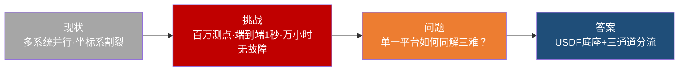
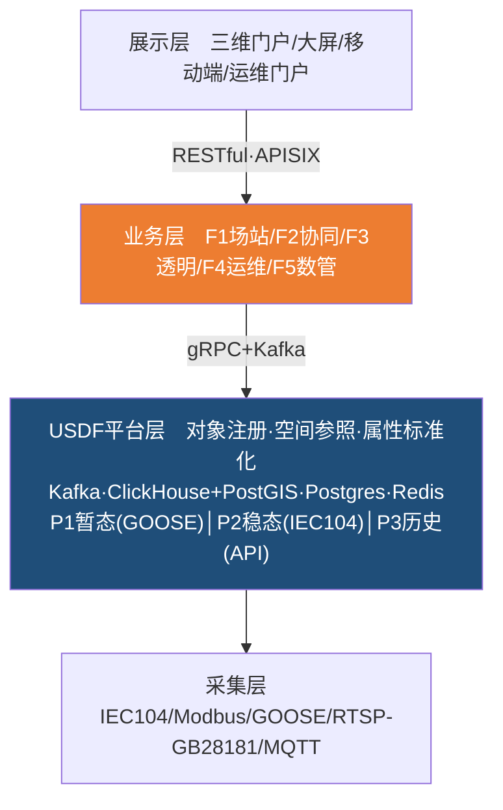
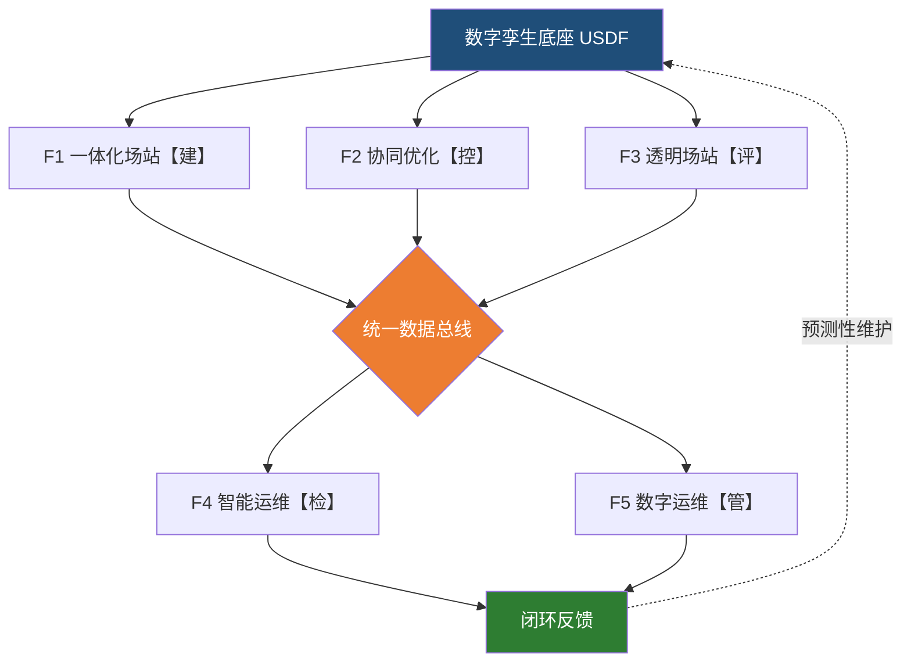
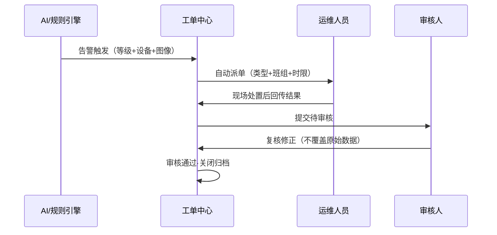
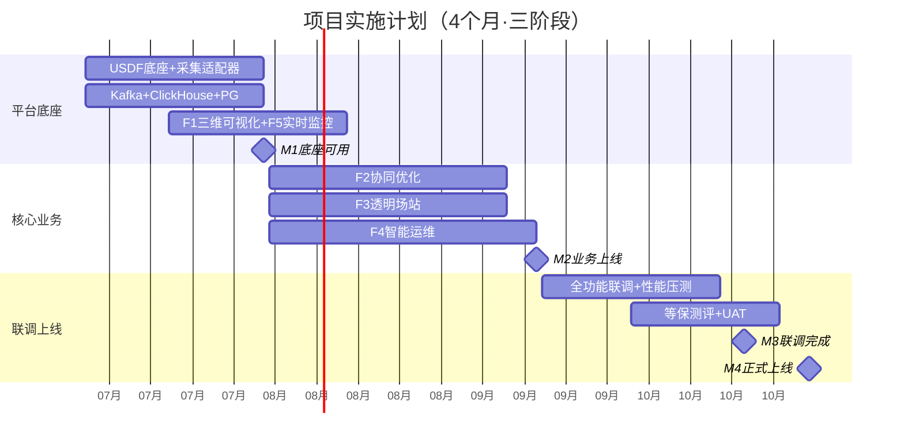

---
aliases:
tags:
  - 段落式
description:
type:
ref-url:
create-date: 2026-06-21 09:28
title: 冀北风光储数智化生产支撑与数字孪生解决方案
subtitle: USDF 统一空间数据底座驱动的新能源场站空间对象操作系统
---

# 冀北风光储数智化生产支撑与数字孪生解决方案

## 内容摘要

冀北风光储基地已进入全面并网运行阶段，但其运维体系仍困在三组结构性矛盾之中。基地内风机、光伏、储能、升压站与输电线路分属不同厂商，各自搭载独立的监控系统，数据格式、通信协议与空间坐标系互不兼容，运维人员不得不在多个系统之间反复切换，全场站的统一态势感知无从谈起；与此同时，百万级测点以秒级乃至毫秒级频率持续产生数据，传统的关系型数据库加轮询架构既扛不住吞吐、又满足不了暂态控制对响应速度的苛刻要求，数据往往在到达决策者手中时便已失效；而当场站试图引入人工智能时，又发现缺乏一个干净、标准、可复用的数据底座，每一个智能化场景都要从零搭建数据管线，投入难以沉淀为可复制的资产。归根结底，这三组矛盾的共同根源，是缺少一个让所有系统"说同一种语言"的统一底座。

针对这一根源，本方案提出以行业首创的统一空间数据底座（USDF）为核心的解决思路。USDF 并非又一个业务系统，而是一层位于数据采集层与业务系统层之间的"空间对象操作系统"——它只负责对象注册、空间参照、属性标准化与统一接口，把"一台设备注册一次、所有业务按需消费"这一原则贯彻到底。在它之上，本方案进一步设计了暂态、稳态、历史三条相互独立的数据通道，分别承载一百毫秒、一秒与五秒三个量级的延迟需求，从而在物理与逻辑两个层面，将原本相互冲突的实时控制与海量监控彻底解耦。

支撑整套架构的，是一种区别于传统方案的逆向方法论。常见的方案书习惯于"我有技术 X、它能解决需求 Y"的正向叙事，本方案则反其道而行，从百万测点、端到端一秒、暂态一百毫秒、五百并发、人工智能检出率不低于八成、平均无故障时间不低于一万小时这六项关键约束指标出发，反推架构必须满足的条件，再据此选型。如此一来，每一个技术决策都有可追溯、可验证、可审计的约束来源，这正是本方案区别于普通系统集成项目的根本先进性所在。

最终，这套方案将转化为一系列可量化的运营收益：人工巡检频次预计降低六成、运维人效提升四成以上，暂态事件的人工介入率下降八成，年度故障损失电量减少一成半到两成，二期新场站的接入工作量降低七成，系统年度非计划停运控制在一次以内。承载这些承诺的，是一支横跨产品规划、地理信息、数字孪生与算法四大领域、各积累二十年以上经验的团队，以及一份总价二百二十万元、较同类全栈平台显著优化的报价。

\newpage

## 第一章 项目概述

### 1.1 项目背景与现实矛盾

冀北风光储基地位于河北省北部，是国家"十四五"新能源发展规划中风光储一体化建设的重点工程，涵盖集中式风电场、光伏电站、电化学储能电站以及配套的升压站与输电线路。基地装机容量大、设备类型多、运行工况复杂，当它从建设期迈入全容量并网运行期之后，原有的运维模式开始显得力不从心，三组结构性矛盾也随之浮出水面。

首先是设备多样性与管理统一性之间的矛盾。基地内的风机、光伏组件、储能电池舱、无功补偿装置与升压站二次设备来自不同厂商，每一类设备都配有自己的监控系统，彼此之间数据格式不一、时间不同步、坐标系不统一。运维人员若要了解一台风机的运行状态，得登录风机的数据采集系统；要查看储能电池，又得切换到能量管理系统；要掌握升压站情况，还要再打开综合自动化系统。这种割裂直接拉长了故障定位的时间，使一线人员的相当一部分精力消耗在系统之间的来回倒切上，而非真正的问题处置。

紧随其后的，是实时控制与数据洪流之间的矛盾。基地的百万级测点持续不断地产生数据，其中风机振动监测以一千赫兹的高频采集，储能电池的内短路预警需要毫秒级响应，而暂态调频指令更要求通过 GOOSE 协议在一百毫秒内完成端到端传输。面对如此规模与速度，传统的关系型数据库加轮询架构难以兼顾吞吐量与延迟，结果便是数据到达决策者手中时往往已经过时，暂态事件只能被动地事后复盘，构网型场站本应具备的主动支撑能力也就形同虚设。

第三组矛盾，则横亘在智能化预期与数字化基座之间。无论是人工智能视觉巡检、构网型性能评价，还是功率协同优化，这些智能化应用对数据标准化程度的要求都极高——算法团队真正需要的，是干净的、结构化的对象数据，而不是原始报文和五花八门的异构格式。然而在缺乏统一底座的情况下，每一个智能化场景都被迫从零开始搭建数据管线，研发周期被拉长两到三倍，模型既难以复用、结果也难以横向比较，企业在智能化上的投入始终无法沉淀为可复制、可迭代的资产。

这三组矛盾叠加在一起，恰恰对应了新型电力系统"高比例可再生能源、高比例电力电子设备"的特征对场站运维提出的三项新要求：场站必须具备自主暂态支撑能力，而非被动依赖电网惯量；运维模式必须从计划检修与故障抢修，转向状态检修与预测性维护；平台架构必须为多场站扩展和人工智能能力的持续迭代预留空间，避免日后推倒重来。正是围绕着化解这三组矛盾、满足这三项要求，本方案展开了它的全部设计。

### 1.2 方案定位与核心理念

本方案的定位可以用一句话概括：构建一套统一空间数据底座，让它成为新能源场站的"空间对象操作系统"。这一定位的关键，在于厘清 USDF 与传统业务系统的本质区别。它不处理任何具体的业务逻辑，而是安静地待在数据采集层之上、业务系统层之下，专注于做好四件事——管理空间参照系、完成对象注册、实现属性标准化、对外提供统一接口。在它之上，一体化数智场站、协同优化、透明场站、智能运维与数字运维管理这五大业务系统，则各自承担独立的业务职责，并通过 USDF 的统一接口去消费已经标准化好的空间对象数据。打一个比方，USDF 是地基，五大业务域是地基之上的楼层，地基只需稳固平整，楼层如何分隔、如何使用，则交由各自的业务逻辑去决定。

值得强调的是，业界普遍的做法是为每一个业务系统单独搭建一条数据管线，本方案则首次将空间数据底座抽象为一个独立的"操作系统层"，从而实现了采集与业务的彻底解耦。正是这种抽象，让"一台设备注册一次、所有业务按需消费"成为可能，也让毫秒级实时驱动与人工智能模型的即插即用具备了统一的支撑。

整套设计始终受四个架构约束的牵引，它们不是并列的修饰词，而是贯穿全部技术决策的硬性边界。"可靠"意味着暂态控制必须走独立通道、安全分区必须物理隔离，检验标准是 GOOSE 延迟不超过一百毫秒、控制区防误绝不妥协。"扩展"意味着 USDF 天生支持多场站，一期就预留好场站标识字段，检验标准是二期既不新增字段也不改动接口。"人工智能友好"意味着北向接口输出的必须是标准化对象与时序数据，检验标准是算法团队完全不必触碰采集层。"实施效能"则意味着边云协同、断网自持与国产化优先，检验标准是一期部署不依赖任何二期才会建设的基础设施。这四条约束，构成了后文一切技术选型背后的统一逻辑。

\newpage

## 第二章 需求理解与分析

本章沿用 SCQA 的结构化思路，把"客户为什么需要这套系统"梳理成一条严密的逻辑链，从现状出发，经由挑战与问题，最终落到唯一可行的架构答案。

就现状而言，冀北基地目前处在多系统并行的运维状态。风机数据采集系统、光伏监控系统、储能能量管理系统、升压站综合自动化系统与视频监控平台各自独立运行，彼此之间的数据既不同格式、也不同步、更不在同一套坐标系下，全场站统一的设备态势感知因此始终无法形成。这一现状本身并非缺陷，而是历史建设逐步叠加的自然结果，但当基地进入全容量并网之后，它所积累的张力便集中爆发为三重挑战。

数据层面的挑战，源于规范对接入规模的硬性要求：系统需要接入百万级实时测点，支持一千赫兹的高频采集，遥测接入总量不低于三百万点，图片存储规模达到两百万张。这样的量级意味着，若仍沿用轮询采集架构，写入瓶颈几乎不可避免——单是百万测点按一秒间隔采样，每秒就有一百万条数据涌入，远超单节点关系型数据库的承载极限。实时性层面的挑战则更为严苛：端到端延迟不得超过一秒，GOOSE 暂态控制通道不得超过一百毫秒，频率采样周期同样要控制在一百毫秒以内。这组要求清楚地表明，所建系统绝不只是一个数据展示平台，而是一套需要承载毫秒级闭环控制的实时系统，数据管线中任何一个环节的迟滞都可能成为致命瓶颈。可靠性层面的挑战，则来自平均无故障时间不低于一万小时、满足等保二级合规、关键部件国产化这三重叠加，再加上电力二次安防对控制区与非控制生产区物理隔离的强制要求——这直接决定了暂态控制与三维可视化无法共处同一安全域，系统架构必须从一开始就天然支持安全分区。

把这三重挑战收拢到一起，便引出了本方案必须回答的核心问题：如何在单一平台之中，同时满足百万测点的实时接入、毫秒级的暂态控制与人工智能的即插即用？这三者对架构的诉求其实是相互冲突的——百万测点要求分布式的数据架构，毫秒暂态要求独立的硬实时通道，安全分区又要求物理上的隔离。要让一个平台同时容纳这三种看似矛盾的能力，唯一可行的路径，就是以三通道分流配合 USDF 统一数据底座为架构核心，把暂态控制与稳态监控在物理和逻辑两个层面彻底分开，由 USDF 统一对象与接口，再由三条独立通道分别去满足三类不同的延迟边界。这正是后续全部技术方案的逻辑起点。



> 图 2-1　从现状到方案的结构化推导

就需求全景而言，依据技术规范书的功能要求与接口要求，本系统共覆盖六大功能域、一百零九项子功能，其中仿真验证相关的十六项作为独立子系统，不在本期交付范围之内。若以数字孪生为叙事主线，其余五大功能域恰好构成一个"建、控、评、检、管"的完整闭环：一体化数智场站平台负责"建"，搭起数字孪生的底座；功率与能量协同优化负责"控"，通过孪生体实现闭环控制；构网型透明场站负责"评"，基于孪生体评估涉网性能；智能运维系统负责"检"，以人工智能驱动预测性维护；数字运维管理平台则负责"管"，让整个运维过程在孪生体的驱动下形成闭环。这五个环节首尾相接，共同支撑起方案的业务骨架，其展开详见第四章。

\newpage

## 第三章 总体技术方案

本章要回答的核心问题只有一个：为什么这套架构能够同时扛住百万测点、毫秒暂态与人工智能的即插即用？答案仍然回到那条逆向方法论——从指标反推架构，让每一个技术选型都有据可查、可被评审追溯。

具体而言，本方案不以技术栈来驱动设计，而是从六项关键约束指标出发，先推导出架构必须满足的条件，再据此挑选最合适的技术。这种"需求要求什么、架构就必须满足什么、于是才选用什么"的逆向逻辑，相比"我有什么技术、所以能解决什么问题"的传统正向叙事，最大的好处在于赋予了整套方案可追溯、可验证、可审计的工程严谨性。在这一方法论的统领下，系统的整体架构围绕"USDF 底座加五大业务域"这一核心原则展开，并遵循"底座先行、业务渐进、多场站可扩展"的三阶段演进路径——一期先在单场站跑通底座与基础监控的数据全链路，再叠加协同优化、透明场站与智能运维三大核心业务，二期则通过场站标识实现逻辑多租户，在架构不变的前提下完成多场站的统一调度。

从总体架构看，系统采用逻辑四层与物理三级部署相结合的方式。逻辑上自上而下分为展示层、业务层、平台层与采集层：展示层负责三维门户、大屏、移动端与运维门户的页面渲染和用户交互，但绝不直连时序库；业务层承载告警规则、工单流程、巡检逻辑与协同策略，但绝不直写采集适配器；平台层即 USDF 底座连同其数据引擎，管理对象元数据、空间索引与缓存加速，但严守边界、不存储时序数据本身；采集层则专注于协议适配与数据归一化，绝不直接写入业务库。这一套"不可越层"的规则，保证了数据流向的清晰与可控。物理上，系统则分布在中心云、场站边缘与设备三级之间，其中场站边缘严格遵循电监会五号令，将控制区、非控制生产区与管理信息区分隔开来——控制区与非控制生产区之间以正向隔离装置实现物理单向传输，非控制生产区与管理信息区之间以防火墙实现逻辑隔离，GOOSE 暂态控制则始终封闭在控制区内闭环运行，绝不跨越安全分区。



> 图 3-1　逻辑四层架构与不可越层边界

在关键技术选型上，本方案始终把握"先进性与落地性兼得"的原则，每一项推荐方案都既有明确的指标依据，又配备了国产化的备选路径。三维引擎之所以选择开源的 Three.js 与 Cesium 组合，是因为它天然 Web 化、免去客户端部署，并能通过水平扩展从容应对五百并发；相比之下，虚幻引擎虽能呈现照片级精度，却既不被浏览器支持、又需要独立客户端，并不契合本场景。时序数据库选用 ClickHouse，原因在于百万测点每秒百万条的写入压力，只有列式存储加向量化引擎才能胜任，而它的写入与聚合性能优于同类产品，必要时还可切换至国产的 TDengine 或 DolphinDB。业务数据库采用 PostgreSQL 并启用 PostGIS 扩展，正是看中其成熟的空间查询能力，国产替代则有达梦与人大金仓可选。消息队列选定 Kafka，因其分区机制足以支撑百万条每秒的吞吐；流媒体采用 ZLMediaKit 直转 GB28181，以应对三百路视频与一千路监测终端的并发接入；人工智能框架则以 PyTorch 负责训练、ONNX Runtime 负责边缘推理，既顺应了视觉巡检模型向 PyTorch 全面迁移的趋势，又借助 ONNX 实现了跨框架的边缘部署。至于接入层的 API 网关、服务注册中心与操作系统，本方案分别优先选用国产的 APISIX、Nacos 与麒麟、统信，在满足国产化要求的同时兼顾性能与生态成熟度。

安全架构方面，本方案围绕等保二级的合规要求逐项落地。身份认证依托认证管理模块，采用 OAuth2.0 与 JWT 并集成客户既有的目录服务；访问控制以基于角色与属性的双重模型实现到增删改查粒度的细粒度授权；安全审计将操作、登录与数据访问的全量日志写入独立且不可篡改的审计库，留存不少于六个月；数据加密则在传输环节采用 TLS 1.3、在存储环节对敏感字段采用 AES-256。这些措施叠加在前述的安全分区之上，再辅以场站与中心云之间的纵向加密认证装置，以及生产控制大区禁用无线通信的硬性规定，共同构成了一套完整的电力二次安防合规体系。

在人工智能引擎的组织上，本方案采用"边缘推理、云端训练、人机协同闭环"的三层结构。场站侧的图形处理服务器负责烟火、通道隐患与设备异常的实时检测，单次推理控制在五百毫秒以内，结果直接写入缓存；中心云的图形处理集群负责模型的微调、标注、版本管理与对比测试，新模型下发不超过三十分钟；运维门户一侧则由人工完成告警确认与误报标注，再将反馈回流至训练集，形成持续优化的闭环。支撑这一闭环的关键策略，是算法团队完全不必触碰采集层——所有训练与推理数据皆经由 USDF 的北向接口获取，新模型只需注册元数据便可即插即用，无需改动任何数据管线。也正因如此，一期虽聚焦于视觉巡检类模型，架构却已为日后的自然语言处理与大模型接入预留了充分空间。至于误检率，一期交付时按行业基线控制在三成以内，再通过人机协同的标注反馈与模型迭代，力争在交付后六个月内降至一成半。

\newpage

## 第四章 业务子系统方案

如果说前三章铺设的是地基与骨架，那么本章呈现的便是五个真正面向运维一线的业务子系统。它们并非彼此孤立的模块，而是围绕数字孪生底座，依"建、控、评、检、管"的次序首尾相连，形成一个持续运转的运营闭环。



> 图 4-0　五大业务子系统"建·控·评·检·管"闭环

处在闭环起点的，是承担"建"之职责的一体化数智场站平台。它是整个系统的数字孪生底座，把分散在五类厂商系统中的数据，统一成可点击、可下钻、可驱动的三维数字资产。在建模环节，风机、光伏组件、储能电池舱、升压站设备与输电线路这五类空间对象，都以统一的对象模型注册到 USDF 底座之上，整个过程无需改动底层代码，只需定义属性集、注册空间层级、配置数据接入源即可；为避免百万级对象拖垮底座，一期采取设备级全覆盖、部件级按需建模的策略，约五百个设备级对象配合一百个关键部件对象，既保证了精度，又控制了规模。在可视化环节，平台基于 Cesium 与 Three.js 构建 Web 原生的三维引擎，把风机的转速功率温度、光伏的辐照度与发电趋势、储能的簇电压与荷电状态、巡检过程的人员路线与缺陷标注一并实时呈现，浏览器即开即用，五百并发则通过水平扩展从容承载。而平台扩展性的真正支柱，在于低代码组态能力——普通技术人员无需编程，仅凭拖拽便能配置监控页面、定义设备模型、编排告警规则乃至生成报表，一期预置的二十余套模板已覆盖风光储的主要监控场景。

承接其后的，是承担"控"之职责的功率与能量协同优化子系统。它把原本被白白浪费的弃风弃光，转化为可调度的收益。在稳态层面，子系统以"减少弃风弃光、兼顾安全、平抑波动、动态最优"为原则，协调风机、光伏逆变器、储能变流器与无功补偿装置四类可调资源：有功上，它实时采集各单元的可发上限，依并网点目标动态分配出力，光伏超发时优先为储能充电、风电低发时由储能放电补足；无功上，它以响应最快的无功补偿装置为主力、以风光储的无功裕度为补充，实现并网点电压的动态调节。所有控制指令在执行之前，都要先后通过指令合法性、状态一致性与安全边界三道校验，任何一道不通过即被阻断并告警。而在暂态层面，子系统则借助 GOOSE 协议实现毫秒级的快速调频与快速调压——频率采样不超过一百毫秒、测频精度优于千分之三赫兹，一旦偏差越限便自动触发有功调整，整条通道直通控制区、不经消息队列中转，端到端延迟稳稳压在一百毫秒以内。

与协同优化相呼应、共同承担涉网职责的，是负责"评"的构网型透明场站子系统。它的价值，在于把过去如同黑箱的涉网性能彻底透明化。在机组层面，它能同时对跟网型与构网型机组进行差异化评价——对跟网型机组考察电网适应性、故障穿越与电能质量，对构网型机组则考察惯量响应、一次调频与暂态电压支撑，并依据相应的国家标准与团体标准，生成跟网与构网在性能、效率、可靠性与经济性四个维度上的量化对标报告。在场站层面，它进一步评价自动发电控制与自动电压控制的响应效果，分析全场站的无功潮流分布并自动检出环流异常。与此同时，它还统一管理风电、光伏与储能三类发电单元的发电量数据，按多种时间维度统计对比，一旦发现异常便自动标记并关联到运维工单，从而把"评"的结果直接导入"检"与"管"的环节。

整个闭环中最贴近现场、也最能解放人力的，是承担"检"之职责的智能运维系统。它以人工智能替代人眼巡检，让缺陷识别的准确率达到九成七以上，把一线人员从高危、高频的重复劳动中解放出来。在升压站，机器人与无人机沿预设路线自主巡视，温度异常识别能够区分正常温升与异常发热，报警时自动抓拍红外与可见光图像并关联设备台账；在光伏区，烟火识别、逆变器诊断、组串诊断与无人机巡检多管齐下，既能在全天候下逐帧捕捉烟火，又能识别九类以上的低效根因；在输电线路，人工智能视觉持续扫描机械外破与环境隐患，自动生成台账并向设备主人主动推送；在储能区，内短路预警与热失控预警以一分钟一轮的节奏完成全量评估，配合一致性分析、周界安防与人员行为识别，构筑起立体的安全防线。所有这些检测一旦触发告警，都会沿着"告警、派单、处置、回传、审核、归档"的闭环流转，全程留痕，且审核修正绝不覆盖原始数据。



> 图 4-1　告警到工单的闭环流转

收束整个闭环的，则是承担"管"之职责的数字运维管理平台。它以一张图统管全场，向上呈现集团层面的电站数量、接入容量与发电总量，向下可一键下钻到单座电站乃至单台设备的实时数据，形成全局、单站、设备三级贯通的监控体系。在此之上，它进一步提供多维度的智能诊断，将告警自动关联到时序曲线以辅助快速定位，并支持手动与自动两种派单模式，让工单从创建到关闭实现全生命周期的追踪。而面向一线班组的智慧运维门户，则把个人待办、值班日历、发电趋势与各类工单汇于一处，并把工作票与操作票的两票管理、排班交接的值班管理一并搬至线上，最终让"管"所积累的运行数据与维护记录，重新反哺到孪生底座，驱动下一轮的预测性维护，使整个闭环得以持续运转。

\newpage

## 第五章 系统非功能特性

先进性最终要落到"承诺与验证"之上。本章将技术规范所列的非功能指标，逐一转化为可测量、可验收的工程承诺，并辅以明确的验证方式，确保每一项指标在交付时都能被客观检验，而非停留在口头。

在平台整体性能上，系统承诺支持不少于五百个已认证会话与每秒五十次以上的活跃操作，并以全链路压测加以验证；历史数据规模达到十亿量级，依托列式数据库的时间分区实现；实时测点达到百万级，通过三十二以上的消息分区配合批量写入，达成每秒百万条的吞吐；实时数据在数据管线内的更新不超过一秒、含三维渲染不超过三秒，由端到端的链路追踪持续度量；历史数据的聚合查询不超过五秒，借助物化视图预聚合与索引优化实现；图片存储则达到两百万张约四太字节，以对象存储配合缩略图分层来承载。

在协同优化与透明场站相关的指标上，调频优化偏差控制在额定功率的正负百分之一并以阶跃测试验证，测频精度优于千分之三赫兹，频率采样周期不超过一百毫秒，遥测接入量不低于三百万点，稳态与暂态通信节点分别不少于两百个与一百个并支持分布式扩展。需要特别说明的是一千赫兹采集精度——电流电压优于千分之二、有功无功优于千分之五，但这一精度取决于前端采集装置，本系统只负责取数而不改变数据本身，因此其验收应以装置的出厂报告为准。透明场站的数据采集、单机评价、场站评价与报告生成，则分别控制在三秒、十秒、三十秒与二十秒以内。

在人工智能性能上，本方案采取"基线达标、持续优化"的稳健策略。检出率一期不低于八成、二期力争提升至九成，误检率一期控制在三成以内、并以交付后六个月降至一成半为优化目标，单次推理在图形处理器上不超过五百毫秒，光伏故障识别在限定九种缺陷类型与双光谱条件下不低于九成七，输电线路告警准确率不低于九成五。这种把承诺值与优化目标分列的做法，既守住了验收的底线，又为后续迭代留出了空间，避免了"一期即承诺极限值"所隐含的验收风险。

```vega-lite
{
  "$schema": "https://vega.github.io/schema/vega-lite/v6.json",
  "title": "四层 SLA 延迟边界（对数轴·毫秒）",
  "data": {"values": [
    {"层级": "L0 暂态(GOOSE直通)", "延迟ms": 100},
    {"层级": "L1 实时(采集→Kafka→Redis→API)", "延迟ms": 1000},
    {"层级": "L2 近实时(含三维渲染)", "延迟ms": 3000},
    {"层级": "L3 历史(时序库聚合)", "延迟ms": 5000}
  ]},
  "mark": "bar",
  "encoding": {
    "y": {"field": "层级", "type": "nominal", "sort": "-x", "axis": {"title": null}},
    "x": {"field": "延迟ms", "type": "quantitative", "scale": {"type": "log"}, "axis": {"title": "延迟上限(ms·对数轴)"}},
    "color": {"field": "层级", "type": "nominal", "legend": null, "scale": {"range": ["#c00000","#ed7d31","#1f4e79","#2e7d32"]}}
  }
}
```

> 图 5-1　四层延迟边界——每层独立通道、独立验收

至于一万小时平均无故障时间这一可靠性核心承诺，本方案则通过多重机制加以保障：关键组件均按 N+1 冗余部署，单节点故障不致中断服务；缓存主从可在三十秒内自动切换，服务注册中心持续健康检查并自动摘除异常节点；消息队列副本因子不低于三、数据库则以副本表与流复制保证多副本；场站边缘一旦断网，本地缓存与轻量数据库可暂存不少于两小时，待网络恢复后自动补传。在此基础上，监控系统持续采集各组件的运行时长、自动记录每一次故障的发生与恢复，从而在质保期内对系统级平均无故障时间进行滚动统计，确保期末达标。

\newpage

## 第六章 项目实施计划

本方案以四个月为周期、分三个阶段、设四个里程碑推进，其节奏安排本身就是一种风险控制——底座先行以降低集成风险，业务渐进以保证阶段可演示，联调上线以确保最终可验收。



> 图 6-1　四个月三阶段实施甘特图

第一阶段聚焦平台底座，在头两个月内完成 USDF 底座与统一采集适配器的部署、数据平台的搭建，以及三维可视化基础场景与实时监控的上线，其里程碑是平台底座可用、实时数据链路打通、百万测点接入通过验证。第二阶段转入核心业务，在第二至第三个月叠加协同优化、透明场站与覆盖四区的智能运维，以及智能诊断与运维门户，其里程碑是核心业务模块上线、三维可视化全场景可用。第三阶段进入联调上线，在第三至第四个月完成增强功能开发、全功能联调、五百并发与百万测点写入的性能压测，以及用户验收测试与等保测评，最终在第四个月末实现系统正式上线、验收文档悉数交付。

支撑这一进度的，是一支配置精当的项目团队，其能力背书远不止于人数。团队横跨电力二次系统、实时大数据、三维地理信息、数字孪生与工业人工智能五个技术域，其中产品设计与规划积累三十年以上，使其经历过三代以上电力信息化架构的演进，能够准确判断架构边界、避免过度设计；地理信息构建积累二十年以上，熟悉从商业引擎到开源方案的全栈选型，能在多源投影转换、海量瓦片发布与三维地形融合等关键环节做出正确决策；数字孪生平台研发同样积累二十年以上，历经四代可视化技术迭代，懂得如何精准定义孪生体的属性、行为与更新模型，而非简单堆砌模型面片；算法领域亦有二十年以上沉淀，覆盖从传统统计到深度学习的全谱系方法，能针对边缘轻量推理、中心批量推理与模型在线更新等不同场景选择最优策略。四项能力叠加，恰好构成"既懂电力业务、又懂数据工程"的交叉密度，而这正是"从指标反推架构"方法论得以落地的根本保障。

\newpage

## 第七章 风险管控

任何严肃的方案都不应回避风险，本方案对技术、业务与实施三个维度共计十八项风险作了前置识别，并为每一项配备了明确的缓解措施。通览全局可以得出一个令人安心的结论：真正属于阻断级的五项风险，无一是纯粹的技术难题，它们要么关乎范围定义、要么关乎团队能力，因而都可以通过清晰的合同边界与合理的团队配置加以化解。

```vega-lite
{
  "$schema": "https://vega.github.io/schema/vega-lite/v6.json",
  "title": "风险分布热力图（数字=风险项数）",
  "data": {"values": [
    {"维度": "技术风险", "等级": "阻断", "数量": 2},
    {"维度": "技术风险", "等级": "高", "数量": 5},
    {"维度": "技术风险", "等级": "低", "数量": 1},
    {"维度": "业务风险", "等级": "阻断", "数量": 2},
    {"维度": "业务风险", "等级": "高", "数量": 3},
    {"维度": "业务风险", "等级": "低", "数量": 0},
    {"维度": "实施风险", "等级": "阻断", "数量": 1},
    {"维度": "实施风险", "等级": "高", "数量": 3},
    {"维度": "实施风险", "等级": "低", "数量": 1}
  ]},
  "mark": "rect",
  "encoding": {
    "x": {"field": "维度", "type": "nominal", "axis": {"title": null, "labelAngle": 0}},
    "y": {"field": "等级", "type": "nominal", "sort": ["阻断","高","低"], "axis": {"title": null}},
    "color": {"field": "数量", "type": "quantitative", "scale": {"scheme": "reds"}}
  }
}
```

> 图 7-1　十八项风险按三维度、三等级分布

在技术维度，最受关注的是百万测点写入瓶颈，本方案以三十二以上的消息分区配合列式存储与批量写入应对，并在第一阶段就优先验证写入性能；暂态通信节点的网络可靠性，则通过虚拟局域网隔离、链路冗余与交换机选型的专项设计加以保障；至于五百并发的定义模糊、端到端延迟是否含渲染等容易引发歧义的问题，则借助前文的分层服务等级协议予以澄清。在业务维度，最需防范的是因定义模糊导致的验收争议与因仿真遗漏导致的报价漏项，对此本方案以可测量的语言重新界定指标、并白纸黑字地写明仿真子系统不在本期范围，从源头上消除争议。在实施维度，GOOSE 协议的集成复杂度通过配备具备相关工程经验的人员并预留多轮现场联调来缓解，百万测点的接入工期压力则以优先接入核心测点、非核心测点二期补全的策略来疏解。如此逐项拆解之后，残留的低风险项已寥寥无几，且均在可接受范围之内。

\newpage

## 第八章 报价与服务

本方案总价二百二十万元（含税），其中每一分投入都对应着明确的交付物。这一报价的依据并非凭空估算，而是参照了电力行业的人月费率基准、南方电网二〇二五年同类三维建模招标以及龙源电力同年全栈平台招标的公开价格区间。相较于同类全栈平台四百一十万至四百五十万元的水平，本报价的显著优化，源于三个实实在在的成本控制因素：一期定位为单场站试点，不含独立的仿真验证子系统，且全栈采用开源技术、免去了商业许可费用。

| 序号  | 报价项      | 说明                           | 金额（万元）  |
| :-: | -------- | ---------------------------- | :-----: |
|  1  | 软件平台     | USDF 底座 + F1-F5 业务系统永久许可     |   23    |
|  2  | 定制开发     | 需求设计编码测试，有效约 28 人月，含项目管理     |   93    |
|  3  | 三维建模     | 风光储与升压站设备级 LOD3 模型           |   40    |
|  4  | GIS 数据服务 | 无人机航测加配准入库，覆盖约 10 km²        |    9    |
|  5  | 硬件设备     | 2 台 GPU 推理 + 2 台应用服务器及网络安全设备 |   28    |
|  6  | 实施与培训    | 现场联调、用户培训与一个月试运行             |   16    |
|  7  | 运维质保     | 2 年质保，含远程支持与版本升级             |   11    |
|  —  | **合计**   |                              | **220** |

```vega-lite
{
  "$schema": "https://vega.github.io/schema/vega-lite/v6.json",
  "title": "报价构成（220万元含税）",
  "data": {"values": [
    {"项目": "定制开发", "金额": 93},
    {"项目": "三维建模", "金额": 40},
    {"项目": "硬件设备", "金额": 28},
    {"项目": "软件平台", "金额": 23},
    {"项目": "实施培训", "金额": 16},
    {"项目": "运维质保", "金额": 11},
    {"项目": "GIS数据", "金额": 9}
  ]},
  "mark": {"type": "arc", "innerRadius": 60},
  "encoding": {
    "theta": {"field": "金额", "type": "quantitative"},
    "color": {"field": "项目", "type": "nominal", "scale": {"range": ["#1f4e79","#2e75b6","#ed7d31","#a6a6a6","#70ad47","#ffc000","#9e480e"]}}
  }
}
```

> 图 8-1　报价构成——定制开发、三维建模与硬件三项合计约占总价七成三

需要向客户说明的是，上述报价不包含独立的仿真验证子系统，软件部分为单场站永久许可、不限用户数，亦不含风机光伏组件等一次设备的采购。由于全栈采用开源技术，方案本身不产生任何商业许可费用，但若客户后期要求改用国产地理信息或国产时序数据库，相应的许可费需另行计算。硬件部分以二〇二五年国产服务器的参考价估算，最终以采购时点行情为准；同时本方案预留了图形处理服务器扩容、应用服务器升级与长期存储节点等若干升级选项，其总溢价约三十五万至五十万元，客户可视需要另行选配，不计入本次报价。

在服务保障方面，本方案承诺两年质保期，期内对系统平均无故障时间持续统计并确保期末达标，远程故障响应不超过两小时、现场不超过二十四小时，影响生产控制区的紧急故障则一小时内远程响应、必要时八小时内抵达现场，质保期内的小版本升级免费、大版本升级费用另议，技术支持则提供全天候电话与远程服务。与之配套的交付物覆盖需求、设计、开发测试、部署上线与验收的全过程文档，并包含除第三方商业组件之外的全部定制开发源代码，确保客户在项目结束后仍能完整掌握系统、自主运维。

 