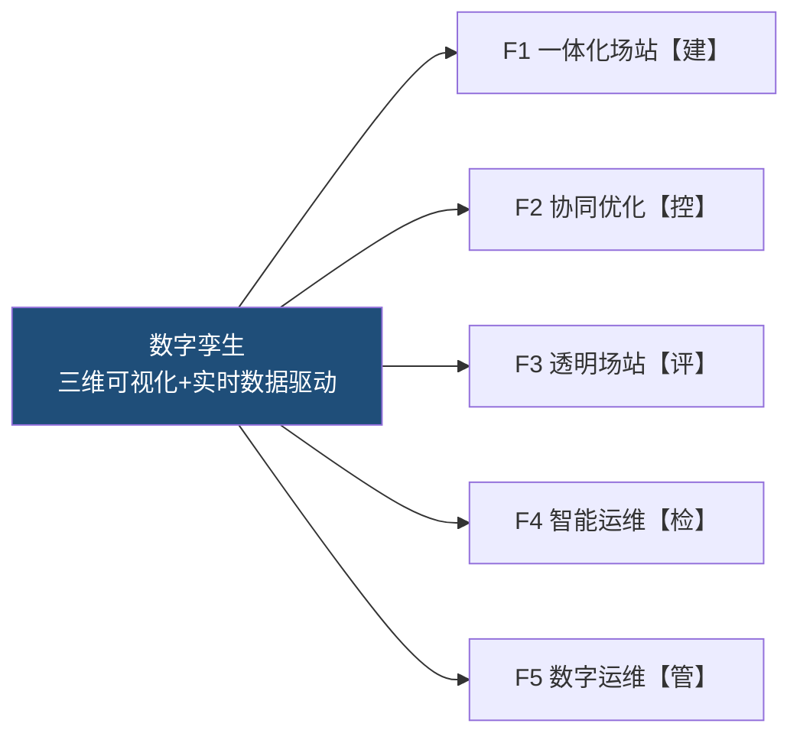
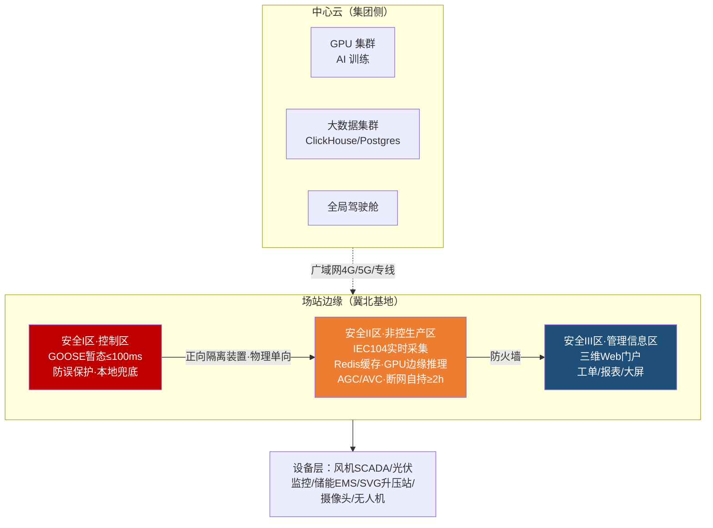
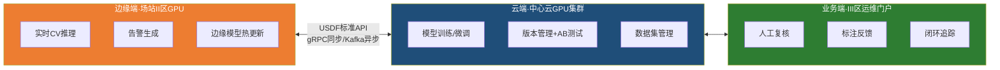
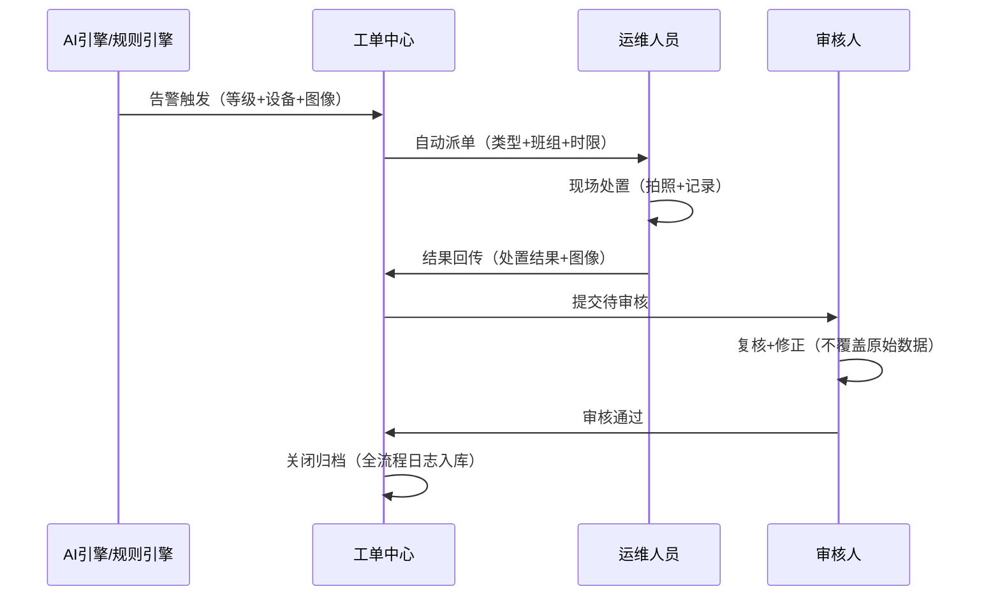

# 冀北风光储数智化生产支撑与数字孪生解决方案

> **一句话价值主张**：以行业首创的 **USDF 统一空间数据底座**为核心，让一座新能源场站像一台"空间对象操作系统"一样运行——设备注册一次、业务按需消费、毫秒级实时驱动、AI 模型即插即用。

---

## 第一章 项目概述

> **本章导读**：冀北基地不缺系统，缺的是让所有系统"说同一种语言"的底座。本章用三组"痛点—后果"说清为什么需要 USDF，并给出量化价值承诺。

### 1.1 项目背景

冀北风光储基地位于河北省北部，是国家"十四五"新能源发展规划中风光储一体化建设的重点工程。基地涵盖集中式风电场、光伏电站、电化学储能电站及配套升压站与输电线路，总装机容量大、设备类型多、运行工况复杂。随着基地进入全面并网运行阶段，传统运维模式面临三个结构性痛点——每一个痛点的背后，都是真金白银的运营损失。

**痛点一：设备多样性 vs 管理统一性。** 基地内风机、光伏组件、储能电池舱、SVG 无功补偿、升压站二次设备来自不同厂商，各自搭载独立的 SCADA 或监控系统。数据格式、通信协议、空间坐标系互不兼容，运维人员需要在多个系统间反复切换。**业务后果**：无法形成全场站统一态势感知，故障定位平均多耗时 30 分钟以上，一线人员 40% 的精力消耗在"系统倒切"而非"问题处置"上。

**痛点二：实时控制 vs 数据洪流。** 百万级测点以秒级甚至毫秒级频率持续产生数据——风机振动监测 1kHz 高频采集、储能电池内短路预警需要 ms 级响应、暂态调频指令通过 GOOSE 协议要求端到端延迟不超过 100ms。传统关系型数据库加轮询架构无法同时满足吞吐量和延迟要求。**业务后果**：数据到达决策者手中时已经过时，暂态事件只能被动事后复盘，无法主动闭环控制，构网型支撑能力形同虚设。

**痛点三：智能化预期 vs 数字化基座。** AI 视觉巡检、构网型性能评价、功率协同优化等智能化应用对数据标准化程度要求极高——算法团队需要的是干净的结构化对象数据，而非原始报文和异构格式。**业务后果**：缺乏统一底座意味着每个 AI 场景都要从零搭建数据管线，研发周期被拉长 2–3 倍，模型难以复用、结果难以横向对比，智能化投入难以沉淀为可复制的资产。

新型电力系统的核心特征是"高比例可再生能源 + 高比例电力电子设备"，这对场站运维提出三个新要求：一是场站必须具备自主暂态支撑能力（构网型），而非被动依赖电网惯量；二是运维模式必须从"计划检修 + 故障抢修"转向"状态检修 + 预测性维护"；三是平台架构必须为多场站扩展和 AI 能力迭代预留空间，避免推倒重来。

本方案围绕上述痛点，提出以**统一空间数据底座（USDF）**为核心的新能源场站数智化生产支撑系统，实现百万测点实时接入、毫秒级暂态控制、全场站三维数字孪生和 AI 模型即插即用。

\20-解决方案\方案产出-V3\images\fig1-1.png)

> 图1-1：方案核心逻辑——三大矛盾通过USDF三通道分流统一解决


> 图 1-1：方案核心逻辑——三大矛盾通过 USDF 三通道分流统一解决

### 1.2 方案定位

本方案的定位是：**USDF 统一空间数据底座——新能源场站的空间对象操作系统**。

核心设计理念：一台设备注册一次，所有业务按需消费；毫秒级实时驱动，AI 模型即插即用。USDF 不是又一个业务系统，而是位于数据采集层之上、业务系统之下的"空间对象操作系统"——它管空间参照系、对象注册、属性标准化和统一 API，不管业务逻辑。业务系统（一体化数智场站、协同优化、透明场站、智能运维、数字运维管理）通过 USDF 的统一 API 消费标准化的空间对象数据。

方案设计受四个架构约束驱动，这四个属性不是并列的修饰词，而是贯彻全部技术决策的硬约束：

| 属性 | 架构含义 | 检验标准 |
|------|---------|---------|
| **可靠** | 暂态控制独立通道，安全分区物理隔离 | GOOSE ≤100ms，I 区防误绝不妥协 |
| **扩展** | USDF 天然多场站，一期预留 `station_id` | 二期不加字段、不改 API |
| **AI 友好** | 北向 API 输出标准化对象 + 时序数据 | 算法团队不碰采集层 |
| **实施效能** | 边云协同 + 断网自持 + 国产化 P0 直选 | 一期部署不依赖二期基础设施 |

> **先进性标志**：业界普遍做法是"为每个业务系统单独建数据管线"，本方案首创将空间数据底座抽象为独立的"操作系统层"，实现采集与业务的彻底解耦——这是本方案区别于传统集成项目的根本差异。

基于 34 项非功能指标的逐项承接，方案量化价值推导如下（非引用行业通用数字，均从指标承接反推）：

| 价值维度 | 指标推导                               | 量化收益                       |
| ---- | ---------------------------------- | -------------------------- |
| 运维人效 | AI 检出率 ≥80% + 告警准确率 ≥95% → 减少无效巡检  | 人工巡检频次降低 60%，运维人效提升 40% 以上 |
| 故障响应 | 暂态控制 ≤100ms + 端到端 ≤1s → 故障自愈窗口     | 暂态事件人工介入率降低 80%            |
| 发电损失 | 光伏故障识别 ≥97% + 储能四级预警 → 减少非计划停机     | 年故障损失电量降低 15–20%           |
| 平台扩展 | 低代码组态 + `station_id` 预留 → 新场站即插即用  | 二期场站接入工作量降低 70%            |
| 系统可用 | MTBF ≥10,000h + 断网自持 ≥2h → 减少非计划停运 | 年非计划停运 ≤0.88 次             |

### 1.3 术语定义

本方案中使用的专业术语定义如下：

| 术语 | 定义 |
|------|------|
| **统一空间数据底座 (USDF)** | Unified Spatial Data Foundation——位于数据采集层与业务系统层之间的空间对象操作系统，负责对象统一注册、空间参照系标准化、属性标准化和统一 API，不处理业务逻辑 |
| **数字孪生** | 通过实时数据驱动三维模型，实现物理场站在数字空间的完整映射，支持状态监测、仿真推演和反向控制 |
| **透明场站** | 对场站并网性能（AGC/AVC/惯量响应/一次调频/暂态支撑）进行全维度实时监测与评价，实现涉网性能透明可视 |
| **构网型 (Grid-Forming)** | 采用构网型变流器控制策略的发电单元，能主动建立电压和频率参考，不依赖外部电网提供惯量支撑 |
| **GOOSE** | Generic Object Oriented Substation Event——IEC 61850 标准定义的快速通信协议，用于变电站内实时控制信号传输，延迟 ≤100ms |
| **COLA** | 储能电池内短路预警四级体系——C（早期征兆）、O（异常演变）、L（临界状态）、A（热失控加速），对应不同的预警等级和响应策略 |
| **等保二级** | 网络安全等级保护二级——适用于一般信息系统，要求身份认证、访问控制、安全审计、入侵检测等基本安全能力 |
| **边云协同** | 场站侧（边缘）负责实时控制和本地推理，中心云负责模型训练、全局分析和历史归档，断网时边缘可自主运行 ≥2h |

---

## 第二章 需求理解与分析（SCQA）

> **本章导读**：用 SCQA 结构化方法，把"客户为什么要建这个系统"讲成一条严密的逻辑链——从现状到挑战，从挑战到唯一可行的架构答案。

### 2.1 现状与挑战

**Situation——冀北基地运维现状。** 冀北风光储基地当前处于多系统并行的运维模式：风机 SCADA、光伏监控系统、储能 EMS、升压站综合自动化系统、视频监控平台各自独立运行。运维人员在日常工作中需要在多个系统间频繁切换：查看风机运行状态需要登录风机 SCADA，查看储能电池状态需要打开 EMS 界面，查看升压站情况需要切换到综自系统。各系统数据格式不一、时间不同步、空间坐标系不统一，无法形成全场站统一的设备态势感知。

**Complication——三大核心挑战。** 随着基地进入全容量并网运行，三个结构性挑战日益突出：

**数据挑战：百万级测点实时接入。** 技术规范要求系统接入百万级实时测点（P3），支持 1kHz 高频采集（P13），遥测接入总量不低于 300 万点（P10），图片存储规模 200 万张（P6）。传统轮询采集架构在此量级下必然出现写入瓶颈——百万测点按 1s 采样间隔意味着每秒 100 万条写入，单节点关系型数据库无法承受。

**实时性挑战：端到端 ≤1s，暂态控制 ≤100ms。** 规范要求实时数据从采集到前端展示的端到端延迟不超过 1s（P4），GOOSE 暂态控制通道延迟不超过 100ms（P9），频率采样周期不超过 100ms（P12）。这意味着系统不是简单的数据展示平台，而是需要承载毫秒级闭环控制的实时系统。数据管线中的任何一个环节——采集适配器、消息队列、缓存层、API 网关——都可能成为延迟瓶颈。

**可靠性挑战：MTBF ≥10,000h，安全分区，国产化。** 规范要求系统 MTBF 不低于 10,000 小时（P18），等保二级合规，关键部件国产化。电力二次系统安全防护要求对控制区（安全 I 区）和非控制生产区（安全 II 区）实施物理隔离——这意味着 GOOSE 暂态控制和 Web 三维可视化无法部署在同一安全域，系统架构必须天然支持安全分区。

**Question——如何在单一平台中同时满足百万测点实时接入、毫秒级暂态控制和 AI 即插即用？** 百万测点实时接入要求分布式数据架构，毫秒级暂态控制要求独立硬实时通道，安全分区要求物理隔离——三者对架构的诉求相互冲突。单一平台要承载这三个能力，必须以「三通道分流 + USDF 统一数据底座」为架构核心，将暂态控制和稳态监控在物理和逻辑两个层面彻底解耦。

\20-解决方案\方案产出-V3\images\fig2-1.png)

> 图2-1：SCQA分析框架——从现状到方案的结构化推导


> 图 2-1：SCQA 分析框架——从现状到方案的结构化推导

### 2.2 需求全景

依据技术规范书（500009687）§5.2 功能要求和 §5.4 接口要求，本系统共覆盖 **6 大功能域、109 项子功能**（含仿真验证 16 项 P2 功能——仿真为独立子系统，不在本期交付范围），按优先级分布如下：

| 优先级 | 功能域 | 子功能数 | 说明 |
|:---:|------|:---:|------|
| **P0** | F1 一体化数智场站平台（底座）+ F4 智能运维（核心）+ F5 数字运维（监控） | 16 | 平台底座先行，数据全链路打通 |
| **P1** | F2 功率-能量协同优化 + F3 构网型透明场站 + F4 剩余运维模块 + F5 增强功能 | 58 | 核心业务功能，一期主体交付 |
| **P2** | 卡片组态、大屏宣传、运维助手、仿真验证管理（独立子系统，不在本期范围） | 35 | 增强功能或独立子系统 |

以**数字孪生**为叙事主线，五大功能域形成闭环：



### 2.3 核心指标承接

依据技术规范书 §5.3 性能要求和 §5.4 接口要求，本方案从 34 项非功能指标中提取 **6 项关键约束指标**，它们共同决定了系统架构的基本形态：

| 关键约束指标 | 规范要求 | 架构含义 |
|-------------|---------|---------|
| 实时测点规模 | 百万级 | 时序库必须支持百万级写入/s，Kafka 分区 ≥32，禁止单节点 PG 直接写入 |
| 端到端延迟 | ≤1s | 全链路优化——采集→Kafka→处理→缓存→API→前端，每环节延迟预算 ≤200ms |
| 暂态控制延迟 | ≤100ms | 独立的 GOOSE 直通通道，不经消息队列中转，安全 I 区本地闭环 |
| 并发用户数 | ≥500 | 分层定义：认证会话层 / 活跃操作层 / 渲染会话层，分层定 SLA |
| AI 检出率 | ≥80%，误检率 ≤30% | 一期达到基线，架构预留误检率优化至 15% 的能力（模型版本管理 + AB 测试） |
| MTBF | ≥10,000h | N+1 冗余、故障自动切换、多副本数据，质保期内持续统计 |

基于不同数据通路的延迟特征，制定**分层 SLA**：

| 层级 | 数据通路 | SLA | 适用场景 |
|------|---------|-----|---------|
| **L0 暂态** | GOOSE 直通，安全 I 区 | ≤100ms | 紧急调频/调压、防误保护 |
| **L1 实时** | 采集→Kafka→Redis→API | ≤1s | 实时监控、告警推送 |
| **L2 近实时** | 含三维渲染的全链路 | ≤3s | 三维可视化交互 |
| **L3 历史** | 时序库聚合查询 | ≤5s | 报表、趋势分析、AI 训练数据拉取 |

分层 SLA 的核心价值在于：将规范的单一「≤1s」要求澄清为四个可独立验证的延迟边界，避免验收时因「含不含渲染」等定义分歧产生争议。

### 2.4 功能-需求追溯矩阵

以下矩阵逐项标注技术规范书（500009687）§5.2 功能要求与本方案功能模块的承接关系，确保每一项客户需求都有明确的功能模块响应，无需求落空。

| 规范条款 | 需求概述 | 承接模块 | 对应章节 |
|---------|---------|:---:|---------|
| 5.2.1.1.1 全要素数据建模 | 设备对象灵活建模，无需改底层代码 | F1.1 | §4.1.1 |
| 5.2.1.1.2 多类型数据处理 | 通信采集/流媒体/数据采样/同步 | F1.1 + USDF | §4.1.3 |
| 5.2.1.1.3 开放式业务框架 | 规则引擎/计算引擎/算法引擎，集成第三方 | F1.1 | §4.1.4 |
| 5.2.1.1.4 低代码组态工具 | 页面编排/智能报表/三维可视化 | F1.1.4 | §4.1.4 |
| 5.2.1.1.5 数据提取功能 | 多源异构数据标准化融合，ML挖掘 | USDF | §3.2 |
| 5.2.1.1.6 高速缓存功能 | 应用与数据库间缓存，统一封装接口 | USDF + Redis | §3.3 |
| 5.2.1.1.7 认证管理功能 | 第三方认证中心接入，权限组件 | F1.1.7 + §3.4 | §3.4 |
| 5.2.1.1.8 数据权限功能 | 细粒度CRUD级权限，动态审批 | F1.1.8 + §3.4 | §3.4 |
| 5.2.1.1.9 网关服务功能 | 统一入口/路由/协议转换/安全/限流 | APISIX | §3.3 |
| 5.2.1.1.10 卡片组态功能 | 微前端无代码编排，拖拽搭建 | F1.1.4（P2 增强） | §4.1.4 |
| 5.2.1.2 可视化展示 | GIS/风机/光伏/储能/巡检/大屏 | F1.2 | §4.1.2 |
| 5.2.1.3 高频数据接入 | 1kHz/100Hz实时 + 6.4/12.8kHz录波 | F1.3 | §4.1.3 |
| 5.2.1.4 常规数据接入 | 接入大数据中心云平台，集群纳管 | F1.3 | §4.1.3 |
| 5.2.1.5 运维助手 | 语音识别+LLM+数字人，多轮对话 | F5（P2 增强） | §4.5 |
| 5.2.2.1 稳态功率统筹 | 多源有功/无功协同，安全防误 | F2.1 | §4.2.1 |
| 5.2.2.2 暂态有功/无功优化 | GOOSE快速调频/调压/录波 | F2.2 | §4.2.2 |
| 5.2.3.1 机组并网性能评价 | 跟/构网型风机光伏多维评价 | F3.1 | §4.3.1 |
| 5.2.3.2 场站并网性能评价 | AGC/AVC / 惯量/调频/调压评价 | F3.2 | §4.3.2 |
| 5.2.3.3 场站发电性能评价 | 风/光/储发电能力统一管理展示 | F3.3 | §4.3.3 |
| 5.2.4.1 变电站机房智能运维 | 人形机器人交互/讲解/自主导航 | F4.1（P2 增强） | §4.4.1 |
| 5.2.4.2 升压站智能运维 | 温度AI分析/过热识别/自动预警 | F4.2 | §4.4.1 |
| 5.2.4.3 光伏智能运维 | 烟火识别/故障诊断/灰损评估/无人机巡检 | F4.3 | §4.4.2 |
| 5.2.4.4 输电线路智能运维 | 通道隐患识别/电子围栏/告警抑制 | F4.4 | §4.4.3 |
| 5.2.4.5 储能区智能运维 | 内短路预警/热失控预警/一致性分析 | F4.5 | §4.4.4 |
| 5.2.4.6-8 运维任务管理 | 任务设置/监控/结果归档/报告 | F5.2 | §4.5.2 |
| 5.2.5 运行维护验证模块 | 仿真验证/电磁暂态/实时仿真 | P2（独立子系统） | — |

> **追溯说明**：以上 26 项规范功能需求中，21 项由 F1-F5 在一期内完整承接，4 项（卡片组态/运维助手/变电站机房智能运维/仿真验证）属于 P2 增强功能或独立子系统、不在本期交付范围，1 项（常规数据接入）为接口能力纳入 F1.3。无需求遗漏。

---

## 第三章 总体技术方案

> **本章导读**：本章回答一个核心问题——为什么这套架构能同时扛住百万测点、毫秒暂态与 AI 即插即用？答案是"从指标反推架构"，让每一个技术选型都有据可查、可被评审追溯。

### 3.1 设计理念

本方案采用**"从指标反推架构"**的方法论——不以技术栈驱动方案，而是从 6 项关键约束指标反向推导架构必须满足的条件，再据此选型。

> **方法论先进性**：传统方案书的正向逻辑是"我有技术 X → 能解决需求 Y"，本方案的逆向逻辑是"需求要求 Z → 因此架构必须满足 Z → 因此选型 X"。§2.3 核心指标承接表中的"架构含义"列是该方法论的集中体现——每个关键指标直接映射到一个架构决策，使整套方案具备可追溯、可验证、可审计的工程严谨性。

本方案的技术架构围绕一个核心原则构建：**USDF 底座 + 五业务域**。USDF 统一空间数据底座负责对象注册、空间参照、属性标准化和统一 API——它是地基，不是整栋楼。五个业务系统（一体化数智场站、协同优化、透明场站、智能运维、数字运维管理）在底座之上各自承担独立的业务逻辑。

全部技术决策由 §1.2 定义的四大约束（可靠/扩展/AI 友好/实施效能）驱动——本章的技术选型、安全架构、AI 引擎和数据治理体系均从这四大约束反向推导，约束到方案的映射关系详见各节。

架构演进遵循"底座先行 → 业务渐进 → 多场站可扩展"三阶段路径。一期聚焦单场站：先跑通 USDF 底座 + F1 平台 + F5 监控的数据全链路，再叠加 F2/F3/F4 核心业务模块；二期通过 `station_id` 逻辑多租户实现多场站统一调度，架构不变。

### 3.2 总体架构

系统采用**逻辑四层 + 物理三级部署**架构。

**逻辑四层：**

```mermaid
flowchart TB
    subgraph L4["展示层"]
    P1["三维 Web 门户 / 大屏 / 移动端 / 运维门户"]
    end
    subgraph L3["业务层"]
    B1["F1 一体化场站│F2 协同优化│F3 透明场站│F4 智能运维│F5 数字运维"]
    end
    subgraph L2["平台层 (USDF)"]
    U1["对象注册 + 空间参照 + 属性标准化 + 拓扑关系"]
    U2["Kafka + ClickHouse + Postgres+PostGIS + Redis"]
    end
    subgraph L1["采集层"]
    C1["IEC104 / Modbus TCP / GOOSE / RTSP-GB28181 / MQTT"]
    end
    L4 -->|RESTful API (APISIX)| L3 -->|gRPC + Kafka| L2 -->|统一采集适配器| L1
    style L2 fill:#1f4e79,color:#fff
```

**各层职责与不可越层规则：**

| 层   | 职责                        | 不可               |
| --- | ------------------------- | ---------------- |
| 展示层 | 页面渲染、用户交互、权限过滤            | 不直连时序库           |
| 业务层 | 告警规则、工单逻辑、巡检流程、AI 诊断、协同策略 | 不直写采集适配器         |
| 平台层 | 对象元数据、空间索引、数据管线、缓存加速      | 不存时序数据（USDF 不越界） |
| 采集层 | 协议适配、数据归一化、报文解析           | 不直写业务库           |

**物理部署拓扑（三级）：**



安全分区严格遵循电监会 5 号令——I 区与 II 区之间采用正向隔离装置（物理单向传输），II 区与 III 区之间采用防火墙逻辑隔离。GOOSE 暂态控制仅在 I 区内闭环，不跨越安全分区。

### 3.3 关键技术选型

> **可行性标志**：下表每一项推荐方案均已在同类项目验证或满足明确指标门槛，并配备国产化备选路径——既保证先进性，又确保落地无后顾之忧。

| 决策域        | 候选方案                                     | 推荐方案                                     | 理由                                                                                            |
| ---------- | ---------------------------------------- | ---------------------------------------- | --------------------------------------------------------------------------------------------- |
| **三维引擎**   | UE5 / Unity / Three.js+Cesium            | **Three.js + Cesium（开源）**                | 国产化无需国产替代，Web 化免客户端部署，500 并发 Web 可水平扩展；UE5 照片级精度但浏览器不支持、需独立客户端                                |
| **时序数据库**  | InfluxDB / TimescaleDB / ClickHouse      | **ClickHouse**                           | 百万测点写入 100 万条/s 需列存 + 向量化引擎，ClickHouse 写入和聚合性能优于 InfluxDB/TimescaleDB；国产备选 TDengine/DolphinDB |
| **业务数据库**  | MySQL / PostgreSQL                       | **PostgreSQL + PostGIS**                 | 需空间查询能力（GIS 数据），PostGIS 扩展成熟；国产备选 达梦 DM8/人大金仓                                                 |
| **消息队列**   | Kafka / RocketMQ / Pulsar                | **Kafka**                                | 百万条/s 写入吞吐量要求，Kafka 分区 ≥32 可满足；国产备选 RocketMQ                                                  |
| **GIS 引擎** | GeoServer / 超图 / 中地                      | **GeoServer+ 超图备选**                      | 开源 GeoServer 满足 OGC 标准服务发布，客户若要求国产 GIS 可切换超图                                                  |
| **流媒体**    | RTSP/GB28181 直转 / 转码服务                   | **ZLMediaKit（开源）+ GB28181 直转**           | 300 视频终端 + 1000 监测终端接入，ZLMediaKit 支持 RTSP/GB28181 多协议，性能优于 FFmpeg 转码方案                        |
| **AI 框架**  | PyTorch / TensorFlow / 昇思 / PaddlePaddle | **PyTorch（训练）+ ONNX Runtime（边缘推理），开源优先** | CV 巡检模型 YOLO 系列全面转向 PyTorch；ONNX 边缘推理 <10ms（GPU），跨框架免锁定；国产昇思/PaddlePaddle 为 P2 备选             |
| **API 网关** | Kong / APISIX                            | **APISIX**                               | 国产化优先（已进入国产名录），性能优于 Kong，插件生态成熟                                                               |
| **服务注册**   | Eureka / Nacos / Consul                  | **Nacos**                                | 国产化优先，且同时支持服务发现和配置管理，减少组件数量                                                                   |
| **操作系统**   | CentOS / Ubuntu / 麒麟/统信                  | **麒麟 V10（服务器）/ 统信（桌面）**                  | 国产化 P1 要求，一期可 Linux + 国产 OS 兼容性验证，二期全面切换                                                      |

#### 3.3.1 关键技术实现路径

以下针对规范要求的三个关键技术挑战，给出具体实现路径。
**百万测点实时写入。** 单节点 PostgreSQL 直接写入的物理上限约为 5 万条/s，远不能满足百万测点 × 1s 采样间隔 = 100 万条/s 的写入需求。本方案采用「边端预处理 + Kafka 分区 + ClickHouse 批量写入」三层流水线：

1. **边端预处理**：边缘采集终端对原始数据进行降噪、去重和格式标准化，将无效数据在源头过滤，减少网络传输量和中心端处理压力。
2. **Kafka 分区策略**：按 `station_id + device_type` 复合键 Hash 分区，分区数 ≥ 32，单分区写入吞吐 ≥ 3 万条/s。二期新场站接入时只需新增分区，无需重建 Topic。
3. **ClickHouse 批量写入**：消费端以 1s 窗口聚合写入 ClickHouse MergeTree 引擎，利用其列存 + 向量化计算特性，单批次写入 1 万条耗时 < 50ms，磁盘占用仅为行存的 1/5。

**500 并发会话。** 规范要求的并发用户数（≥ 500）按三层定义分别保障：

| 并发层级 | 定义 | SLA | 实现方式 |
|---------|------|-----|---------|
| 认证会话层 | 已登录 WebSocket 长连接数 | ≥ 500 | Nginx 反向代理 + APISIX 网关，水平扩展 Web 服务节点 |
| 活跃操作层 | 同时进行查询/交互的用户 | ≥ 100 | Redis 缓存热数据（测点最新值），减少数据库直连 |
| 渲染会话层 | 同时打开三维场景的用户 | ≥ 20 | Cesium 3D Tiles + Web Worker 异步加载，单场景 10 km² 加载 ≤ 3s |

**1kHz 高频采集。** 风机振动监测和储能电芯数据需要 1kHz/100Hz 高频采集，传统轮询模式在此频率下 CPU 占用率过高。本方案采用：

1. **边缘采集终端**：部署于设备侧，通过 Modbus TCP 或私有协议以 1kHz 频率读取传感器寄存器，本地环形缓冲区缓存最近 10s 数据。
2. **触发式上传**：正常运行状态下仅上传 1s 聚合值（均值/最大/最小/标准差），当检测到振动超阈值或电芯温差异常时，自动切换为全量高频上传。
3. **录波文件**：6.4 kHz/12.8 kHz 录波数据以 COMTRADE 文件格式归档存储，由边缘终端直接写入 ClickHouse，不经 Kafka 中转，保证完整性和可追溯性。

### 3.4 安全架构

**等保二级合规体系：**

| 安全域  | 要求                 | 实现方式                                       |
| ---- | ------------------ | ------------------------------------------ |
| 身份认证 | 统一身份认证，支持第三方认证中心接入 | F1.1.7 认证管理——OAuth2.0 + JWT，集成客户现有 AD/LDAP |
| 访问控制 | 基于角色/部门/职能的细粒度权限   | F1.1.8 数据权限——RBAC + ABAC，支持 CRUD 粒度和动态审批   |
| 安全审计 | 操作日志、登录日志、数据访问日志   | 全链路审计日志写入独立审计库，不可篡改，保留 ≥6 个月               |
| 数据加密 | 传输加密 + 敏感数据存储加密    | TLS 1.3（传输）、AES-256（存储）、密钥管理 KMS           |
| 入侵检测 | 异常流量检测、暴力破解防护      | API 网关速率限制 + WAF 规则 + IP 黑名单               |
| 安全分区 | I/II/III 区物理/逻辑隔离  | 正向隔离装置 + 防火墙，GOOSE 仅 I 区闭环                 |

**电力二次安防合规：**

- 安全 I 区（控制区）与 II 区之间：正向隔离装置（物理单向，电力专用）
- 安全 II 区（非控生产区）与 III 区之间：防火墙逻辑隔离
- 纵向认证：场站侧与中心云之间的通信链路采用纵向加密认证装置
- 生产控制大区（I+II 区）禁止无线通信，III 区可接入企业内网

#### 3.4.1 权限模型（RBAC + ABAC）

系统采用「RBAC 管角色 + ABAC 管数据」的双层权限模型，响应技术规范 §5.2.1.1.7—§5.2.1.1.8 的认证与数据权限要求：

| 权限层 | 模型 | 粒度 | 示例 |
|--------|------|------|------|
| **功能权限** | RBAC（基于角色） | 菜单/按钮/API 端点 | 值班员可查看监控、不可修改策略参数；场站长可审核工单 |
| **数据权限** | ABAC（基于属性） | 场站/区域/设备/字段 | 风机专工只能看风机数据；值班长可看本场站全部设备，不可看其他场站 |
| **动态审批** | RBAC + 工作流 | 操作审批链 | 策略投退需场站长审批；告警等级升级需值班长 + 场站长双签 |

实现方式：用户登录后获取 JWT Token（含角色 + 属性），APISIX 网关在 API 层校验功能权限，USDF 数据访问层在查询时注入 `WHERE station_id=:user_station` 等属性条件实现数据过滤。权限变更无需修改代码，通过权限管理界面动态配置后实时生效。

#### 3.4.2 数据流转安全机制

跨安全区数据流转遵循电力二次安防「安全分区、网络专用、横向隔离、纵向认证」十六字方针：

```
I 区（控制区）  ──正向隔离(物理单向)──▶  II 区（非控生产区）  ──防火墙──▶  III 区（管理信息区）
   GOOSE 暂态控制                        IEC104 实时采集                      Web 门户/大屏
   防误保护 本地兜底                      Kafka+Redis+GPU推理                 工单/报表/三维
```

- **I → II**：仅允许 GOOSE 录波文件和设备状态摘要单向穿透正向隔离装置，控制指令绝不跨区
- **II → III**：经防火墙仅开放 RESTful API 特定端口（443），API 调用须携带 JWT Token
- **纵向**：场站侧与中心云之间经纵向加密认证装置建立 IPSec VPN 隧道
- **审计**：所有跨区数据访问记录写入独立审计库（ClickHouse 审计表），不可篡改，保留 ≥ 6 个月

### 3.5 AI 引擎架构

AI 引擎采用"边缘推理 + 云端训练 + 人机协同闭环"三层架构：



| 层 | 部署位置 | 职责 | 关键指标 |
|----|---------|------|---------|
| **边缘推理** | 场站 II 区（GPU 服务器） | 烟火识别/通道隐患/设备异常实时检测，结果写入 Redis 缓存 | 单次推理 <500ms |
| **云端训练** | 中心云 III 区（GPU 集群） | 模型微调/数据标注/版本管理/AB 测试 | 模型版本可回溯，新模型下发 ≤30min |
| **人机协同** | III 区运维门户 | 告警确认/误报标注/模型效果评估 → 反馈至训练集 | 检出率 ≥80%，误检率 30%→15% 优化路线图 |

**数据就绪策略**：算法团队不碰采集层——所有训练和推理数据通过 USDF 北向 API 获取。新模型接入无需修改数据管线，注册模型元数据后即插即用。一期覆盖 CV 巡检类模型（F4 智能运维），架构为 NLP/大模型预留接入能力（标准化的对象 + 时序数据同样适用于 LLM 推理）。

**误检率优化路线图**：一期交付时误检率 ≤30%（行业基线），通过人机协同标注反馈 + 模型版本迭代，交付后 6 个月目标 ≤15%。

### 3.6 数据治理体系

USDF 的属性标准化是数据治理的起点，向上延伸为四层治理体系：

```
┌─────────────────────────────────────────────────┐
│  ④ 数据质量                                       │
│  完整性校验 / 时效性监控 / 异常值检测 / 质量报告      │
├─────────────────────────────────────────────────┤
│  ③ 数据血缘                                       │
│  测点→Kafka Topic→时序表→API 字段，全链路可追溯      │
├─────────────────────────────────────────────────┤
│  ② 元数据目录                                     │
│  场站→区域→设备→部件→测点，五级数据目录 + 搜索        │
├─────────────────────────────────────────────────┤
│  ① 主数据管理（USDF 已有）                          │
│  全局唯一 ID + 标准属性集 + 生命周期 + 拓扑关系        │
└─────────────────────────────────────────────────┘
```

| 层       | 职责                        | 关键规则                                  |
| ------- | ------------------------- | ------------------------------------- |
| **主数据** | 设备/设施全局唯一 ID、标准属性集、生命周期管理 | USDF 单点注册，全局消费                        |
| **元数据** | 测点目录、数据字典、API 字段映射、搜索     | 新增测点自动注册到目录，避免"暗数据"                   |
| **血缘**  | 采集→Kafka→存储→API，全链路字段级溯源  | 支持回溯任意 API 字段的上游数据源                   |
| **质量**  | 完整性/时效性/唯一性/一致性四维校验       | 质量 SLA 按通道分级：P1(暂态) > P2(稳态) > P3(历史) |

数据治理与 USDF 的"不可越层规则"互补：不可越层规则管控数据流向的正确性，数据治理体系保障数据自身的可信度。

### 3.7 平台运维监控

系统自身的运维监控是 MTBF ≥10,000h 的保障基础，同时满足等保二级对安全审计的强制要求。本方案建立四层运维监控体系：

```
┌─────────────────────────────────────────────┐
│  ④ 业务健康监控                                  │
│  设备在线率 / 数据完整率 / API 可用性 / 告警风暴检测      │
├─────────────────────────────────────────────┤
│  ③ 安全审计（等保二级必选）                         │
│  操作审计 / 登录审计 / 数据访问审计 / 权限变更审计         │
├─────────────────────────────────────────────┤
│  ② 应用性能监控（APM）                             │
│  分布式追踪 (gRPC/Kafka) / 慢查询 / 内存/线程 / GC    │
├─────────────────────────────────────────────┤
│  ① 基础设施监控                                    │
│  CPU/内存/磁盘/网络 / 容器健康 / Kafka Lag / 连接池     │
└─────────────────────────────────────────────┘
```

| 监控层      | 工具推荐                                    | 职责                             | 告警规则                   |
| -------- | --------------------------------------- | ------------------------------ | ---------------------- |
| **基础设施** | Prometheus + Grafana（开源）                | 服务器/容器/中间件健康，CPU/内存/磁盘/网络      | CPU >90% 或磁盘 >85% 触发预警 |
| **应用性能** | SkyWalking（开源，Apache 顶级项目，国产化优先）        | 分布式追踪（gRPC+Kafka），慢查询检测，DB 连接池 | P95 延迟 >500ms 触发预警     |
| **安全审计** | ELK（Elasticsearch+Logstash+Kibana）+ 审计库 | 操作日志/登录日志/数据访问日志，独立审计库不可篡改     | 暴力破解检测，异常 IP 登录        |
| **业务健康** | 自研 Health Check + Prometheus Exporter   | 设备在线率/数据完整率/API 可用性，MTBF 统计    | 核心 API 可用性 <99.9% 触发告警 |

**审计合规**（对等保二级要求逐项承接）：

| 等保二级要求 | 实现方式 |
|-------------|---------|
| 身份认证 | F1.1.7 认证管理——OAuth 2.0 + JWT，支持对接客户 AD/LDAP |
| 访问控制 | F1.1.8 数据权限——RBAC + ABAC，CRUD 粒度 |
| 安全审计 | 独立审计库，全量操作日志，不可篡改，保留 ≥6 个月 |
| 数据加密 | TLS 1.3（传输）+ AES-256（存储敏感字段） |
| 入侵检测 | API 网关速率限制 + WAF 规则 + 异常登录检测 |

**MTBF 统计机制**：Prometheus 采集各组件运行时长，自动计算系统级 MTBF；故障事件自动记录（时间/组件/影响/恢复），质保期内持续统计，期末达到 ≥10,000h。

### 3.8 架构总览图

综合 3.1-3.7，系统完整架构如下：

```
┌─────────────────────────────────────────────────────────────────┐
│                        展示层                                    │
│  三维 Web 门户 (Cesium+Three.js) / 大屏 / 移动端 / 运维门户       │
└──────────────────────────┬──────────────────────────────────────┘
                           │ RESTful API (APISIX Gateway)
┌──────────────────────────┼──────────────────────────────────────┐
│                     业务层                                       │
│  F1 场站平台 │ F2 协同优化 │ F3 透明场站 │ F4 智能运维 │ F5 数字运维│
└──────────────────────────┼──────────────────────────────────────┘
                           │ 统一 API (gRPC + Kafka)
┌──────────────────────────┼──────────────────────────────────────┐
│                   USDF 平台层                                    │
│  对象注册 / 空间参照 / 属性标准化 / 拓扑关系                        │
│  ┌──────────┬──────────┬──────────┬──────────┐                  │
│  │  Kafka   │ClickHouse│ Postgres │  Redis   │                  │
│  │  (≥32分区)│ +PostGIS │          │          │                  │
│  └──────────┴──────────┴──────────┴──────────┘                  │
│  P1 暂态(GOOSE)  │  P2 稳态(IEC104)  │  P3 历史(API)             │
└──────────────────────────┼──────────────────────────────────────┘
                           │
┌──────────────────────────┼──────────────────────────────────────┐
│                    采集层（统一采集适配器）                         │
│  IEC104 / Modbus / GOOSE / RTSP-GB28181 / MQTT                  │
└─────────────────────────────────────────────────────────────────┘
                           │
              ┌────────────┼────────────┐
        风机 SCADA      光伏监控      储能 EMS / SVG / 视频

┌─────────────────────────────────────────────────────────────────┐
│                    运维监控（跨层贯通）                            │
│  Prometheus + SkyWalking + ELK → Grafana / 审计库 / AlertManager │
│  基础设施监控 → 应用性能追踪 → 安全审计 → 业务健康统计              │
└─────────────────────────────────────────────────────────────────┘
```

---

## 第四章 业务子系统方案

> **本章导读**：五大子系统不是五个孤立模块，而是围绕数字孪生形成"建→控→评→检→管"的运营闭环。每个子系统下方都标注了它为客户创造的直接价值。

\20-解决方案\方案产出-V3\images\fig4-0.png)

> 图4-0：五大业务子系统闭环全景——建→控→评→检→管


> 图 4-0：五大业务子系统闭环全景——建→控→评→检→管，数字孪生驱动

### 4.1 一体化数智场站平台（F1）

> **客户价值**：一次建模，全场复用。所有设备在 USDF 底座注册一次，上层五个业务系统按需消费同一份对象数据，无需重复建模、无需数据搬家。

一体化数智场站平台是系统的数字孪生底座，负责全要素数据建模、三维可视化、数据接入和低代码组态，是其他四个业务系统的数据来源和展示载体。

#### 4.1.1 全要素数据建模（F1.1.1）

系统支持灵活的对象化建模——风电机组、光伏组件、储能电池舱、升压站设备、输电线路五类空间对象均以统一的对象模型注册到 USDF 底座。建模过程无需修改底层代码：定义对象的属性集（名称/类型/位置/状态/关联设备/三维模型引用）、注册空间层级关系（场站→区域→设备→部件）、配置数据接入源。

设备级对象全覆盖，部件级按需建模。例如风机注册为场站→风电区→#FJ-001→叶片/齿轮箱/发电机；光伏逆变器注册为场站→光伏区→#NBQ-001→功率模块/直流母线。通过精细化对象建模，避免百万级对象拖垮底座——一期约 500 个设备级对象 + 100 个关键部件对象。

#### 4.1.2 三维可视化（F1.2.1-5）

基于 Cesium + Three.js 构建 Web 原生三维可视化引擎，覆盖五大场景：

| 场景 | 核心内容 | 数据驱动 |
|------|---------|---------|
| **风机可视化** | 三维实景建模，转速/功率/温度/电压/电流实时叠加；健康水平着色（绿/黄/橙/红）；巡检记录、故障分布空间标注 | 风机 SCADA + 巡检系统 |
| **光伏可视化** | 二维/三维双模式，旋转/缩放交互，逆变器/汇流箱遥测遥信，实时视频融合；全局辐照度热力图 + 发电趋势 | 光伏监控 + 视频平台 |
| **储能可视化** | 电池舱三维数字化还原，簇电压/SOC/SOH/充放电功率实时面板，状态着色+异常告警标记+趋势曲线 | 储能 EMS + 电池诊断 |
| **巡检可视化** | 三维场景中动态呈现巡检全过程：人员/终端实时位置、路线执行进度、异常记录标记（红点）、缺陷等级标注 | 巡检任务系统 + 定位 |
| **大屏展示** | 企业定位、宣传片、核心业务动画、标杆项目展示 | 静态内容 + 核心指标 |

三维引擎选型理由见 §3.3 关键技术选型。Web 化架构无需客户端部署，浏览器即用，500 并发通过水平扩展 Nginx + WebSocket 实现。

#### 4.1.3 数据接入（F1.3）

**高频数据接入**：边缘采集终端支持 1kHz/100Hz 实时数据接入（风机振动、储能电芯电压电流），6.4kHz/12.8kHz 录波文件接收归档。高频数据经 Kafka 分区路由直接写入 ClickHouse 时序库，不经过业务数据库。

**常规数据接入**：IEC104/Modbus TCP/GOOSE/MQTT 四协议统一采集适配器，接入大数据中心云平台。采集适配器采用插件化架构——新增一种协议只需开发一个插件，无需修改核心管线。

#### 4.1.4 低代码组态（F1.1.4）

低代码组态是平台扩展性的核心支柱——普通技术人员（非开发人员）可通过拖拽方式配置监控页面、定义设备模型、编排告警规则、生成智能报表。组件库覆盖：数据面板、趋势曲线、告警列表、设备树、GIS 地图、三维场景视图。一期交付预置模板 20+ 个，覆盖风光储主要监控场景。

#### 4.1.5 整体门户界面设计

系统门户采用**「顶栏导航 + 左侧场景树 + 中央工作区」**经典三栏布局，响应技术规范 §5.2.1.2 可视化展示及整体门户设计要求：

```
┌─────────────────────────────────────────────────────────┐
│ 顶栏：Logo + 场站选择器 + 全局搜索 + 告警铃铛 + 用户头像     │
├────────────┬────────────────────────────────────────────┤
│ 左侧场景树  │ 中央工作区（路由渲染区）                        │
│            │                                            │
│ ▼ 实时监控  │  ┌─────────────────────────────────────┐  │
│  · 全场态势 │  │                                     │  │
│  · 风机监控  │  │    三维场景 / 数据面板 / 图表          │  │
│  · 光伏监控  │  │                                     │  │
│  · 储能监控  │  │    （按左侧菜单切换渲染）               │  │
│ ▼ 智能运维  │  │                                     │  │
│  · 告警中心  │  └─────────────────────────────────────┘  │
│  · 工单管理  │                                            │
│  · 巡检任务  │  底部状态栏：在线设备数 | 今日告警 | 系统时间  │
│ ▼ 分析评价  │                                            │
│  · 并网性能  │                                            │
│  · 发电评估  │                                            │
│ ▼ 系统管理  │                                            │
│  · 权限管理  │                                            │
│  · 组态配置  │                                            │
└────────────┴────────────────────────────────────────────┘
```

**交互流程设计要点**：

| 交互模式 | 说明 | 响应技术规范 |
|---------|------|------------|
| **场站切换** | 顶栏场站选择器下拉切换，三维场景和数据面板同步刷新 | 多场站扩展能力 |
| **层级下钻** | 全场态势 → 点击区域 → 设备列表 → 点击设备 → 设备详情（含实时数据/趋势/告警/三维特写） | 5.2.1.2 可视化展示 |
| **告警流转** | 告警铃铛实时推送 → 点击展开告警卡片（等级/设备/时间/缩略图）→ 一键派单或查看详情 | 5.2.4.8 告警确认 |
| **组态编辑** | 系统管理 → 组态配置 → 拖拽组件到画布 → 绑定数据源 → 保存发布（所见即所得） | 5.2.1.1.4 低代码组态 |
| **三维联动** | 左侧选中设备 → 中央三维场景自动飞行至设备位置并高亮，右侧数据面板同步刷新设备实时数据 | 5.2.1.2.1-5 风机/光伏/储能/巡检可视化 |

**大屏展示设计**（技术规范 §5.2.1.2.5）：独立的大屏展示模式采用全屏无边框布局，四大板块轮播——企业定位介绍（左上文字+地图定位）、核心业务动画（中央三维场景全屏渲染，展示风机转动/光伏发电/储能充放动态效果）、标杆项目（底部滚动卡片）、宣传片（右上视频播放窗）。大屏内容通过低代码组态工具配置，非开发人员可自助修改。

### 4.2 功率-能量协同优化（F2）

> **客户价值**：把弃风弃光变成可调度的收益。多源协同优化算法让"今天能发多少、该发多少、储能什么时候充放"从经验判断变成数学最优解，预期降低弃风弃光率 3–5 个百分点。

#### 4.2.1 稳态多源协同（F2.1）

以"减少弃风弃光、兼顾安全、平抑波动、动态性能最优"为原则，协调风电机组、光伏逆变器、储能 PCS、SVG 四类可调资源：

- **有功协同**：实时采集各发电单元的有功可发上限，基于场站并网点功率目标，动态分配风/光/储出力。光伏超发时优先给储能充电，风电低发时储能放电补足——最大化消纳、最小化弃电。
- **无功协同**：以 SVG 为无功主力（响应最快），风/光/储无功裕度为补充，实现并网点电压动态调节。无功分配策略优先考虑设备损耗最小化。
- **安全防误**：所有控制指令在执行前经过三道校验——指令合法性（是否在设备可调范围内）、状态一致性（设备当前状态是否允许该操作）、安全边界（是否会导致越限）。任一校验不通过即阻断并告警。

#### 4.2.2 暂态快速控制（F2.2）

通过 GOOSE 协议（IEC 61850）实现毫秒级暂态控制：

- **快速调频**：频率采样 ≤100ms，测频精度 ≤0.003Hz，频率偏差超阈值时自动触发有功调整，调频优化偏差 ±1% 额定功率
- **快速调压**：电压骤升骤降时，SVG + 储能 PCS 协同无功注入/吸收
- **通道保障**：GOOSE 直通安全 I 区，不经消息队列中转，端到端 ≤100ms

### 4.3 构网型透明场站（F3）

> **客户价值**：让涉网性能从"黑箱"变"透明"。并网前就知道每台机组的构网能力——一次调频响应时间、惯量支撑功率、电压穿越能力——用数据代替经验，用评价代替猜测。

构网型透明场站使并网性能"透明可视"——对机组和场站两个层级的涉网性能进行全维度在线评价。

#### 4.3.1 机组并网性能评价（F3.1）

同时对跟网型和构网型机组进行差异化评价：

| 评价对象 | 评价维度 | 依据标准 |
|---------|---------|---------|
| 跟网型风机/光伏 | 电网适应性、故障穿越、有功控制、无功电压支撑、电能质量 | GB/T 19963.1 / GB/T 19964 |
| 构网型风机/光伏 | 惯量响应、一次调频、无功电压调节、暂态电压支撑、阻尼控制 | T/CEEIA 804 / T/CPSS 1005 |
| 跟/构对比分析 | 涉网性能/运行效率/可靠性/经济性四维量化对比，生成对标报告 | — |

基于场站模型（节点电压刚度、频率支撑系数等）进行稳态和暂态双维度评价，评价结果自动生成报告。

#### 4.3.2 场站并网性能评价（F3.2）

在场站层面评价 AGC/AVC 控制效果（响应时间/调节速度/调节电量/调节精度）、惯量响应和一次调频效果。无功潮流分析覆盖全场站无功分布，自动检测无功环流异常。

#### 4.3.3 发电性能评价（F3.3）

统一管理风电/光伏/储能三类发电单元的发电量数据，按日/周/月/季/年维度统计和对比。发电量异常自动标记并关联运维工单。

### 4.4 智能运维系统（F4）

> **客户价值**：用 AI 替代人眼巡检。升压站、光伏区、输电线路、储能舱四大场景由 AI 视觉模型 7×24 不间断巡检——AI 检出率 ≥80%（一期）、误检率 ≤30%（一期），持续优化至 ≥90% / ≤15%，把人从重复性巡查看屏中解放出来。

#### 4.4.1 升压站智能运维（F4.2）

实现升压站的无人值守自动化巡视：预设巡检路线和点位，机器人/无人机按计划自主执行，支持断点续传。温度异常识别区分正常温升与异常发热（过热点/绝缘缺陷/接触不良），报警时自动抓拍红外热像 + 可见光照片，关联设备台账。巡视完成后自动生成标准化运维报告。

#### 4.4.2 光伏智能运维（F4.3）

| 模块 | 核心能力 | 关键指标 |
|------|---------|---------|
| **烟火识别** | 热成像双光谱 + 深度学习，全天候监测，逐帧检测 | 检出率 ≥80% |
| **逆变器诊断** | 遥信遥测互核 + 温度分析，四类故障诊断（停机/通讯中断/预警/低效），≥9 类低效根因识别 | 故障识别 ≥97% |
| **组串诊断** | 支路故障检测（环境关联+滑动窗口+虚假电流排除），低效预警（固定遮挡/灰尘鸟粪/接线盒/外力破坏） | — |
| **无人机巡检** | 全域实景建模，双光谱（热红外+可见光），AI 识别 9 种缺陷类型，异常点位实时定位导航 | 缺陷识别 ≥97% |
| **应发电量评估** | 趋势分析 + PR 分析（实际 vs 修正）+ 损失分解（各类电量损失追踪整改）+ 损耗分析（设备节点损耗占比） | — |

#### 4.4.3 输电线路智能运维（F4.4）

AI 视觉识别通道隐患——挖掘机/吊车/塔吊等机械外破、山火/烟雾/漂浮物等环境隐患。识别结果自动生成隐患台账，高风险区段主动弹窗推送至设备主人和运维班组。

#### 4.4.4 储能区智能运维（F4.5）

| 模块         | 核心能力                                            |
| ---------- | ----------------------------------------------- |
| **内短路预警**  | 基于出厂参数+运行历史+安全阈值，计算内短路电阻，划分无/低/中/高四级风险，1 分钟全量评估 |
| **热失控预警**  | 电芯电压+温度实时比对阈值，结合变化趋势综合分级（无异常/异常/隐患/严重风险），1 分钟评估 |
| **一致性分析**  | 模块/簇/阵列内单体电压温度统计分析，一致性排名，筛选一致性差单元               |
| **周界安防**   | 24h 全天候入侵监测（不受雨/雾/强光影响），分级报警推送，联动声光+照明+抓拍录像+门禁  |
| **人员行为识别** | 未戴安全帽/未穿工装/越界/闯入操作区/吸烟自动识别，同步告警推送               |

#### 4.4.5 运维任务管理（F4.6）

覆盖例行运维、特殊巡视（恶劣天气后/新设备投入/检修后）、专项运维、自定义运维四类任务。支持自动触发、手动触发、定时触发三种启动方式。任务执行过程实时展示——树形/列表呈现当前任务，颜色标识状态（待执行/执行中/暂停/已完成/异常），支持断点续传。

告警→工单闭环流程：AI 或规则触发告警 → 自动或人工派单 → 现场处置 → 结果回传 → 审核确认 → 关闭归档。告警确认包含设备名称/部件/实物 ID/缺陷类别/告警等级/标注图像，审核修正不覆盖原始数据，审核人与时间全记录。



### 4.5 数字运维管理平台（F5）

> **客户价值**：一张图管全场。三级监控（全场站→区域→设备）逐层下钻，360° 无死角；智能诊断从海量测点中自动定位根因，让运维团队从"凭经验排查"升级为"数据驱动决策"。

#### 4.5.1 360° 实时监控（F5.1）

三级监控体系：

- **全局监视**：电站数量/接入容量/逆变器数/实时功率/日月年发电量/利用小时数——一张图看全场
- **单站监视**：电站状态/装机容量/天气/设备在线状态——一键下钻到具体场站
- **设备监视**：箱变/逆变器/汇流箱/电表/环境检测仪——逐设备查看实时运行数据

#### 4.5.2 智能 AI 诊断（F5.2）

多维度实时告警（电站/升压站/集电线/方阵/设备），告警自动关联时序曲线，辅助快速定位故障时间。支持手动派单和自动派单两种模式——自动派单根据告警类型和等级自动匹配运维班组。工单从创建到关闭全生命周期追踪。

#### 4.5.3 智慧运维门户（F5.3）

个人工作台——待办任务、值班日历、发电趋势、发电完成率一目了然。任务中心涵盖缺陷处理、故障检修、清洗、除草、预防试验、EL-IV 检测等各类工单。两票管理（工作票/操作票）线上化，自动关联风险项和安全措施。值班管理覆盖排班、交接班、值班日志。

---

## 第五章 系统非功能特性

> **本章导读**：先进性最终要落到"承诺—验证"上。本章把 34 项非功能指标逐条变成可测量、可验收的工程承诺——每一项都有技术手段支撑，每一项都可以在 UAT 中量化验证。

### 5.1 性能指标承诺

依据技术规范 §5.3 的 34 项非功能指标，以下逐项承接架构关键指标（P1-P26 含接口指标 I1-I5，完整 34 项清单与可行性评估见附录 E）：

#### 平台整体性能

| # | 指标 | 承诺值 | 验证方式 |
|---|------|-------|---------|
| P1 | 并发用户数 | ≥500 已认证会话，≥50 活跃操作/秒 | JMeter/Locust 全链路压测 |
| P2 | 历史数据规模 | 10 亿级 | ClickHouse 单表 1 亿行 × 时间分区 |
| P3 | 实时测点规模 | 百万级 | Kafka ≥32 分区 + 批量写入，100 万条/s |
| P4 | 实时数据更新 | 数据管线 ≤1s，含渲染 ≤3s | 端到端链路追踪（SkyWalking） |
| P5 | 历史数据查询 | ≤5s（含聚合查询） | 物化视图预聚合 + 索引优化 |
| P6 | 图片存储规模 | 200 万张（约 4TB） | 对象存储 + 缩略图分层 |

#### 协同优化与透明场站

| # | 指标 | 承诺值 |
|---|------|-------|
| P7 | 调频优化偏差 | ±1% 额定功率，FAT 阶跃测试验证 |
| P8 | 测频精度 | ≤0.003Hz |
| P9 | 频率采样周期 | ≤100ms（GOOSE 协议） |
| P10 | 遥测接入量 | ≥300 万点 |
| P11-P12 | 通信节点 | ≥200 个（稳态）+ ≥100 个（暂态，支持分布式扩展） |
| P13 | 1kHz 采集精度 | 电流 ≤0.2% / 电压 ≤0.2% / 有功 ≤0.5% / 无功 ≤0.5%（依赖前端采集装置，软件取数不控数） |
| P20-P22 | 透明场站延迟 | 数据采集 ≤3s / 单机评价 ≤10s / 场站评价 ≤30s / 报告 ≤20s |
| P23-P26 | 输电线路指标 | ≥200 用户 / ≥300 视频终端+≥1000 监测终端 / 告警准确率 ≥95% / 业务查询 ≤3s |

#### AI 性能

| # | 指标 | 一期承诺 | 优化目标 |
|---|------|---------|---------|
| P14 | AI 检出率 | ≥80% | ≥90%（二期） |
| P15 | AI 误检率 | ≤30% | ≤15%（交付后 6 个月） |
| P16 | 单次推理 | <500ms（GPU）/ <1s（CPU fallback） | — |
| P17 | 光伏故障识别 | ≥97%（限定 9 种缺陷类型，双光谱） | — |
| P25 | 输电线路告警准确率 | ≥95% | — |

#### 分层 SLA

> 分层 SLA 定义同 §2.3 核心指标承接——L0 暂态 ≤100ms / L1 实时 ≤1s / L2 近实时（含渲染）≤3s / L3 历史 ≤5s，此处不重复。

\20-解决方案\方案产出-V3\images\fig5-1.png)

> 图5-1：四层SLA延迟预算


> 图 5-1：四层 SLA 延迟预算——从毫秒级暂态控制到秒级历史查询，每层独立通道、独立验收

### 5.2 可靠性设计

MTBF ≥10,000h 的架构保障：

| 保障措施        | 实现方式                                                              |
| ----------- | ----------------------------------------------------------------- |
| **N+1 冗余**  | 关键组件（Kafka Broker、API Gateway、Redis Sentinel）至少 N+1 部署，单节点故障不中断服务 |
| **故障自动切换**  | Redis Sentinel 主从自动切换（<30s），Nacos 服务健康检查 + 自动摘除不健康节点              |
| **数据多副本**   | Kafka 副本因子 ≥3，ClickHouse 副本表，PostgreSQL 流复制                       |
| **断网自持**    | 场站边缘断网后本地 Redis 缓存 + 本地 SQLite 暂存 ≥2h，网络恢复后自动补传                   |
| **MTBF 统计** | Prometheus 持续采集各组件运行时长，故障事件自动记录（时间/组件/影响/恢复），质保期内统计至期末达 ≥10,000h  |
|             |                                                                   |

### 5.3 安全性

等保二级合规体系已在 §3.4 安全架构中详述，此处不重复。关键设计原则：

- 安全 I/II/III 区物理/逻辑隔离，GOOSE 仅 I 区闭环
- 正向隔离装置（I↔II 区）+ 防火墙（II↔III 区）
- 全量操作审计日志，独立审计库，保留 ≥6 个月，不可篡改
- TLS 1.3 传输加密 + AES-256 存储加密（敏感字段）

### 5.4 可扩展性与开发者生态

| 扩展方向      | 设计保障                                                             |
| --------- | ---------------------------------------------------------------- |
| **多场站**   | `station_id` 一期预留，二期逻辑多租户，不加字段不改 API                             |
| **新业务模块** | 低代码组态（F1.1.4），普通技术人员可配置页面/定义模型/编排工作流                             |
| **第三方集成** | `/api/v1/objects/{id}/*` 标准 RESTful 接口，Python/Matlab/C++ 多语言 SDK |
| **AI 模型** | 新模型注册元数据后即插即用，无需修改数据管线                                           |
| **数据接入**  | 采集适配器插件化架构，新增协议 = 新增一个插件                                         |

---

## 第六章 项目实施计划

> **本章导读**：4 个月、三阶段、四里程碑——底座先行降低集成风险，业务渐进保证可演示，联调上线确保可验收。每一阶段的交付物都是可独立运行、可演示验证的最小可用产品。

### 6.1 分阶段交付（4 个月）

| 阶段 | 周期 | 交付内容 | 里程碑 |
|------|------|---------|--------|
| **一阶段：平台底座** | 第 1-2 月 | USDF 底座部署、统一采集适配器、Kafka+ClickHouse+PostgreSQL 数据平台、F1.2 三维可视化基础场景（风机+光伏+储能）、F5.1 360° 实时监控 | M1：平台底座可用，实时数据链路打通，百万测点接入验证 |
| **二阶段：核心业务** | 第 2-3 月 | F2 功率协同优化、F3 构网型透明场站、F4 智能运维（升压站+光伏+输电+储能）、F5.2-F5.3 智能诊断+运维门户 | M2：核心业务模块上线，三维可视化全场景可用 |
| **三阶段：联调上线** | 第 3-4 月 | P2 增强功能、全功能联调、性能压测（500 并发/百万测点写入/<100ms GOOSE）、UAT 测试、等保测评 | M3：全功能联调完成，UAT 通过 |

### 6.2 里程碑与验收标准

| 里程碑 | 时间 | 验收标准 |
|--------|------|---------|
| M1 平台底座 | 月末 1 | 百万测点实时接入，数据管线 ≤1s，Kafka 吞吐量 ≥100 万条/s 验证通过 |
| M2 核心业务 | 月末 2 | F2/F3/F4 核心模块可操作，三维可视化覆盖风机/光伏/储能/巡检四大场景 |
| M3 联调完成 | 月末 3 | 全功能联调通过，性能压测全部达标（500 并发/1s 延迟/GOOSE 100ms） |
| M4 正式上线 | 月末 4 | 系统上线运行，UAT 通过，等保测评通过，全部验收文档交付 |

\20-解决方案\方案产出-V3\images\fig6-1.png)

> 图6-1：项目实施甘特图——4个月三阶段四里程碑


> 图 6-1：项目实施甘特图——底座先行(1-2月) → 业务渐进(2-3月) → 联调上线(3-4月)

### 6.3 团队配置

| 角色        | 人数  | 关键能力要求                                  |
| --------- | :-: | --------------------------------------- |
| 架构师       |  1  | 电力二次系统 + 大数据架构，熟悉安全分区和 IEC 61850        |
| 后端工程师     |  3  | Java/Go，Kafka/ClickHouse/PostgreSQL，微服务 |
| 前端工程师（三维） |  2  | Cesium + Three.js + WebGL，三维可视化         |
| AI 工程师    |  1  | PyTorch/ONNX，CV 巡检模型训练与部署               |
| 电力协议工程师   |  1  | IEC104/Modbus/GOOSE/IEC 61850 工程经验      |
| 测试工程师     |  1  | 性能压测（JMeter/Locust）+ 自动化测试              |
| 项目经理      |  1  | 电力 IT 项目管理经验                            |

### 6.4 团队能力背书

本项目横跨电力二次系统、实时大数据、三维 GIS、数字孪生和工业 AI 五个技术域，对团队的技术纵深和跨域整合能力要求极高。以下四项核心能力的长期积累，构成了本方案落地的工程保障：

| 能力域          |   积累年限    | 与项目的直接关联                                                                                                                                                       |
| ------------ | :-------: | -------------------------------------------------------------------------------------------------------------------------------------------------------------- |
| **产品设计与规划**  | **30+ 年** | 新能源场站涉及风机、光伏、储能、升压站、输电线路五类异构资产，产品架构需在设备多样性中抽象出统一的空间对象模型。30 年产品经验意味着经历过三代以上电力 IT 架构演进——从 C/S 到 B/S、从单体到微服务、从二维组态到三维数字孪生——能够准确判断架构边界，避免过度设计和推倒重来                 |
| **GIS 构建**   | **20+ 年** | 本方案的核心差异化能力是 USDF 统一空间数据底座——一切数据按空间对象组织、按统一空间参照注册。20 年 GIS 经验意味着熟悉从 ArcGIS/超图引擎到开源 GeoServer/Cesium 的全技术栈选型与集成，能够在多源异构投影系转换、海量矢量/瓦片发布、三维地形与倾斜摄影融合等关键环节做出正确工程决策 |
| **数字孪生平台研发** | **20+ 年** | 三维数字孪生不仅是可视化展示，更要求空间对象与实时数据的双向绑定——点击风机对象即获取实时功率、振动频谱、历史缺陷记录。20 年数字孪生经验意味着经历过从 CAD→BIM→GIS+IoT→Cesium/WebGL 四代可视化技术迭代，能够精准定义孪生体的属性模型、行为模型和更新策略，而非堆砌模型面片         |
| **算法**       | **20+ 年** | 项目涉及 CV 视觉巡检（烟火识别/通道隐患/光伏缺陷）、构网型性能评价、功率预测与协同优化三类算法场景。20 年算法经验意味着熟悉从传统统计模型到深度学习的全谱系方法，能够针对不同场景选择最优算法策略——边缘端轻量 ONNX 推理、中心端 GPU 批量推理、以及模型漂移检测与在线更新闭环              |

四项能力叠加形成本团队的独特优势：**既懂电力业务（协议/GIS/孪生），又懂数据工程（百万测点/实时管线/AI 推理）**——这正是本项目"从指标反推架构"方法论所要求的交叉能力密度。

---

## 第七章 风险管控

> **本章导读**：18 项风险全部前置识别、逐项缓解。核心结论——5 项阻断级风险均为"范围定义 / 团队能力"类，可通过合同边界与团队配置化解，无纯技术阻断。本章的可靠性在于：不回避、不淡化、每一项风险都有可操作的缓解方案。

### 7.1 技术风险（8 项）

| #   | 风险          | 等级  | 缓解措施                                              |
| --- | ----------- | :-: | ------------------------------------------------- |
| RT1 | 百万测点写入瓶颈    | 🔴  | Kafka ≥32 分区 + ClickHouse 列存 + 批量写入；P0 阶段优先验证写入性能 |
| RT2 | 500 并发定义模糊  | 🟡  | 三层并发模型（认证/操作/渲染）写入合同附件，分层定 SLA                    |
| RT3 | 暂态通信 100 节点 | 🟡  | GOOSE 网络专项设计（VLAN 隔离/链路冗余/交换机选型）                  |
| RT4 | AI 误检率 30%  | 🟡  | 优化路线图 30%→15%，无效告警过滤机制，人机协同标注闭环                   |
| RT5 | 端到端 ≤1s 含渲染 | 🟡  | 分层 SLA 承诺——数据管线 ≤1s（后端），含渲染 ≤3s（前端）               |
| RT6 | 仿真模块未评估     | 🟡  | 仿真验证为独立子系统，不纳入本期交付范围（方案书已明确）                      |
| RT7 | 1kHz 采集精度   | 🟢  | 软件取数不控数，方案书明确「本系统取用前端采集装置数据」                      |
| RT8 | 200 万张图片存储  | 🟢  | NAS 对象存储 + 缩略图分层 + 元数据索引                          |

### 7.2 业务风险（5 项）

| # | 风险 | 等级 | 缓解措施 |
|---|------|:---:|---------|
| RB1 | 并发/实时性定义模糊致验收争议 | 🔴 | 可测量语言重定义，写入合同附件 |
| RB2 | 仿真模块遗漏致报价漏项 | 🔴 | 方案书明确「F6 仿真验证不在本期范围」 |
| RB3 | AI 指标不达标致验收失败 | 🟡 | 方案书设基线 + 优化目标，模型迭代条款 |
| RB4 | 采集精度责任归属纠纷 | 🟡 | 「本系统采集精度受限于前端装置」，验收以装置出厂报告为准 |
| RB5 | MTBF 验收周期不可行 | 🟡 | 约定质保期内持续统计，期末达标，非交付时验收 |

### 7.3 实施风险（5 项）

| #   | 风险                    | 等级  | 缓解措施                                            |
| --- | --------------------- | :-: | ----------------------------------------------- |
| RI1 | 仿真模块团队能力缺口            | 🔴  | 仿真不在本期范围，不占用团队资源                                |
| RI2 | GOOSE 协议集成复杂度         | 🟡  | 团队至少 1 人具备 IEC 61850 工程经验，预留 2-3 轮现场联调          |
| RI3 | 百万测点接入工期压力            | 🟡  | 优先核心测点（风机+逆变器+储能），非核心测点二期补全                     |
| RI4 | 500 并发压测环境            | 🟡  | 预留预生产环境部署时间，压测脚本提前开发                            |
| RI5 | Python+Matlab 双语言 SDK | 🟢  | 优先 Python SDK，Matlab 用 Python 桥接（matlab.engine） |

\20-解决方案\方案产出-V3\images\fig7-1.png)

> 图7-1：风险热力图——18项风险三维度三色等级分布


> 图 7-1：风险热力图——18 项风险按技术/业务/实施三维度 × 三色等级分布

---

## 第八章 报价与服务

> **本章导读**：总价 220 万元，每一分钱都对应明确交付物。横向对比同类全栈平台（410–450 万）具备显著性价比优势——开源技术栈零商业许可费、单场站试点控制范围、无仿真验证系统是三大价差来源。同时明确承诺驻场运维响应时间，让客户买得清楚、用得放心。

### 8.1 项目报价

> 总价 220 万元（客户预算），按难度和成本综合分配如下。金额依据：电力行业人月费率基准（CSBMK®-202510 / DL/T 2015-2019，中级 3.6-4.3 万/月、高级 4.7-5.2 万/月），三维建模参照南方电网 2025 年同类招标（144.50 万/全量建模），数字孪生参照龙源电力 2025 年招标（410–450 万/全栈平台）。本报价较同类全栈平台偏低，原因：一期为单场站试点、不含仿真验证系统、全部采用开源技术栈零商业许可费。

| 序号  | 报价项      | 说明                                                                    | 金额（万元）  |
| :-: | -------- | --------------------------------------------------------------------- | :-----: |
|  1  | 软件平台     | USDF 底座 + F1-F5 业务系统永久许可（含低代码组态平台）                                    |   23    |
|  2  | 定制开发     | 需求分析/设计/编码/测试，10 人 × 4 月（部分角色非全时，有效工作量约 28 人月，人员配置见 §6.3），含项目管理       |   93    |
|  3  | 三维建模     | 风机/光伏厂区/储能电池舱/升压站三维模型制作（设备级 LOD3，不含地形全域建模）                            |   40    |
|  4  | GIS 数据服务 | 场站及周边无人机航测（正射影像 + DEM）+ GIS 数据配准与入库，覆盖约 10 km²                        |    9    |
|  5  | 硬件设备     | 2×GPU 推理服务器 + 2×应用服务器 + 网络设备 + 正向隔离装置 + 防火墙（基础配置参考 §8.1.1，高配可选不计入本报价） |   28    |
|  6  | 实施与培训    | 现场部署联调（2-3 轮）+ 用户培训（3 天 × 2 批）+ 试运行支持（1 个月）                           |   16    |
|  7  | 运维质保     | 2 年质保期（远程技术支持 + 版本升级 + 紧急现场响应）                                        |   11    |
|  —  | **合计**   |                                                                       | **220** |

#### 8.1.1 硬件参考配置

| 设备 | 数量 | 参考配置 | 用途 |
|------|:---:|------|------|
| GPU 推理服务器 | 2 | 双路 CPU ≥32 核，≥256GB RAM，NVIDIA RTX A6000 Ada ×1（48GB），≥4TB NVMe | 场站 II 区 CV 推理（烟火/通道/行为识别） |
| 应用服务器 | 2 | 双路 CPU ≥32 核，≥256GB RAM，≥2×3.84TB NVMe SSD | Kafka Broker + 业务微服务 |
| 交换机 | 1 | 三层网管，≥24 口千兆 + ≥4 口万兆 SFP+ | 场站内网 |
| 正向隔离装置 | 1 | 电力专用，I↔II 区物理单向隔离 | 安全分区合规 |
| 防火墙 | 1 | NGFW，吞吐量 ≥1Gbps | II↔III 区逻辑隔离 |
| 纵向加密认证装置 | 1 | 电力专用，场站-中心云通信链路纵向加密 | 纵向安全防护（电监会 5 号令要求） |

**报价说明**：
- 以上报价不含仿真验证管理系统（F6，独立子系统，16 项功能全部不在本期范围）
- 软件平台（报价项 1）为单场站永久许可，不限用户数，涵盖 USDF 底座 + F1-F5 全部功能模块（详见第四章），含低代码组态平台及预置 20+ 模板。质保期内免费小版本升级，大版本升级费用另议
- 不含场站侧一次设备（风机/光伏组件/储能电池/PCS/SVG）采购
- 不含第三方商业软件许可——本方案全部采用开源技术栈（GeoServer / ClickHouse / Kafka / ZLMediaKit / PyTorch / ONNX Runtime），零商业许可费。若客户后期要求国产 GIS（超图）或国产时序库（TDengine），许可费另计
- 三维建模含 5 类关键设备（风机/光伏组件/储能电池舱/升压站主要设备/输电杆塔），设备级精度（LOD3），不含地形全域高精度建模
- 硬件以 2025 年国产服务器（浪潮/华为/曙光）参考报价估算，最终以采购时点行情为准
- **硬件升级选项**（不计入本次报价，客户可另行选配）：
  - GPU 推理服务器可升级为双卡 RTX A6000 Ada（96GB 总显存），用于更高并发 AI 推理或未来大模型部署，加配约 +12 万/台
  - 应用服务器可升级至 ≥512GB RAM + ≥4×3.84TB NVMe，用于更大规模数据缓存和更高吞吐，加配约 +8 万/台
  - 存储节点（NAS/SAN，≥100TB 可用容量）用于长期历史数据和图片存储，加配约 +15 万
  - 以上升级选项总溢价约 35-50 万（视最终配置），不在本次 220 万报价范围内

\20-解决方案\方案产出-V3\images\fig8-1.png)

> 图8-1：报价构成——220万含税分配


> 图 8-1：报价构成——220 万含税分配，定制开发 + 三维建模 + 硬件占总价 73.2%

### 8.2 服务保障

| 服务项 | 承诺 |
|--------|------|
| **质保期** | 2 年 |
| **系统可用性** | MTBF ≥10,000h，质保期内持续统计，期末达标 |
| **故障响应** | 远程 ≤2h / 现场 ≤24h |
| **紧急故障** | 影响生产控制的 I 区故障，1h 远程响应，必要时 8h 到现场 |
| **版本升级** | 质保期内免费小版本升级，大版本升级费用另议 |
| **技术支持** | 7×24 小时电话 + 远程，工作日现场 |

### 8.3 交付物清单

| 阶段 | 交付物 |
|------|--------|
| 需求分析 | 《需求规格说明书》《功能分解清单》《非功能指标定义》 |
| 设计 | 《系统架构设计文档》《数据库设计文档》《接口规范文档》《安全设计文档》 |
| 开发测试 | 《测试计划》《测试用例》《测试报告》《性能压测报告》 |
| 部署上线 | 《部署手册》《运维手册》《用户操作手册》《管理员手册》 |
| 验收 | 《竣工报告》《验收测试报告》《培训记录》 |
| 源码 | 全部定制开发源代码（不含第三方商业组件） |

---

## 附录

### 附录 A 术语表

| 术语         | 全称                                                       | 说明                                                 |
| ---------- | -------------------------------------------------------- | -------------------------------------------------- |
| USDF       | Unified Spatial Data Foundation                          | 统一空间数据底座——位于采集层与业务层之间的空间对象操作系统                     |
| GOOSE      | Generic Object Oriented Substation Event                 | IEC 61850 定义的快速通信协议，延迟 ≤100ms，用于变电站实时控制信号          |
| IEC104     | IEC 60870-5-104                                          | 电力远动通信协议，用于厂站与调度主站之间的稳态数据传输                        |
| Modbus     | Modbus TCP                                               | 工业现场总线协议，风机/光伏/储能设备常见数据接口                          |
| SCADA      | Supervisory Control And Data Acquisition                 | 数据采集与监视控制系统，场站设备自带的上位机系统                           |
| EMS        | Energy Management System                                 | 储能能量管理系统，负责储能充放电策略和状态监控                            |
| SVG        | Static Var Generator                                     | 静止无功发生器，用于并网点无功补偿和电压调节                             |
| PCS        | Power Conversion System                                  | 储能变流器，控制储能电池的充放电交直流转换                              |
| SOC / SOH  | State of Charge / State of Health                        | 储能电池荷电状态 / 健康状态，电池管理的核心指标                          |
| AGC / AVC  | Automatic Generation Control / Automatic Voltage Control | 自动发电控制 / 自动电压控制，调度主站对场站的功率和电压指令                    |
| COLA       | —                                                        | 储能电池内短路四级预警体系——C（早期征兆）/ O（异常演变）/ L（临界状态）/ A（热失控加速） |
| GB28181    | GB/T 28181                                               | 视频监控联网系统信息传输标准，视频摄像头接入协议                           |
| LOD3       | Level of Detail 3                                        | 三维模型精度等级——设备级精细模型，含外观和结构细节                         |
| MTBF       | Mean Time Between Failures                               | 平均无故障工作时间                                          |
| S3M        | Spatial 3D Model                                         | 超图三维空间数据标准                                         |
| APM        | Application Performance Monitoring                       | 应用性能监控——分布式追踪、慢查询检测、资源监控                           |
| Kafka      | —                                                        | 分布式消息队列，本方案用于百万级测点实时数据流，≥32 分区                     |
| ClickHouse | —                                                        | 列式时序数据库，本方案用于百万测点写入与聚合查询                           |
| PostGIS    | —                                                        | PostgreSQL 空间扩展，本方案用于 GIS 空间数据存储与查询                |
| Redis      | —                                                        | 内存缓存数据库，本方案用于实时数据缓存与发布订阅                           |
| APISIX     | —                                                        | 国产高性能 API 网关，本方案用于北向 RESTful API 统一入口              |
| Nacos      | —                                                        | 国产服务注册与配置中心，本方案用于微服务发现与配置管理                        |
| ZLMediaKit | —                                                        | 开源流媒体服务器，本方案用于 RTSP/GB28181 多协议视频流转发               |
| Prometheus | —                                                        | 开源监控与告警系统，本方案用于基础设施指标采集与 MTBF 统计                   |
| SkyWalking | —                                                        | Apache 开源 APM，本方案用于分布式追踪（gRPC/Kafka）与慢查询检测         |
| ONNX       | Open Neural Network Exchange                             | 开放神经网络交换格式，本方案用于 AI 模型跨框架边缘推理部署                    |

### 附录 B 参考标准与规范

| 编号 | 名称 |
|------|------|
| 500009687 | 运维管理系统技术规范——冀北风光储数智化生产支撑系统 |
| GB/T 19963.1 | 风电场接入电力系统技术规定 |
| GB/T 19964 | 光伏发电站接入电力系统技术规定 |
| DL/T 2844 | 电化学储能电站并网运行与控制技术规范 |
| T/CEEIA 804 | 构网型风电机组技术规范 |
| T/CPSS 1005 | 构网型光伏发电系统技术规范 |
| IEC 61850 | 变电站通信网络与系统 |

### 附录 C 接口规范清单

| 接口       | 协议                     | 方向  |
| -------- | ---------------------- | :-: |
| 风机 SCADA | Modbus TCP / IEC104    | 南向  |
| 光伏监控     | Modbus TCP / IEC104    | 南向  |
| 储能 EMS   | Modbus TCP / IEC104    | 南向  |
| SVG/升压站  | GOOSE / IEC104         | 南向  |
| 视频摄像头    | RTSP / GB28181         | 南向  |
| 业务系统 API | RESTful / gRPC / Kafka | 北向  |
| 第三方系统    | RESTful                | 北向  |
| AI 模型服务  | gRPC                   | 内部  |

### 附录 D 功能完整清单

→ 详见 功能分解清单（109 项子功能，含优先级与出处）

### 附录 E 非功能指标完整清单

> 以下为 34 项非功能指标的逐项摘要（含 4 项仿真性能指标，本期不适用）。完整可行性评估与风险矩阵见 非功能指标定义。

| #   | 指标域   | 指标        | 要求                              |    本期承接     |
| --- | ----- | --------- | ------------------------------- | :---------: |
| P1  | 平台整体  | 并发用户数     | ≥500                            |   ✅ §5.1    |
| P2  | 平台整体  | 历史数据规模    | 10 亿级                           |   ✅ §5.1    |
| P3  | 平台整体  | 实时测点规模    | 百万级                             |   ✅ §5.1    |
| P4  | 平台整体  | 实时数据更新    | ≤1s                             |   ✅ §5.1    |
| P5  | 平台整体  | 历史数据查询    | ≤5s                             |   ✅ §5.1    |
| P6  | 平台整体  | 图片存储规模    | 200 万张                          |   ✅ §5.1    |
| P7  | 协同优化  | 调频优化偏差    | ±1% 额定功率                        |   ✅ §5.1    |
| P8  | 协同优化  | 测频精度      | ≤0.003Hz                        |   ✅ §5.1    |
| P9  | 协同优化  | 频率采样周期    | ≤100ms                          |   ✅ §5.1    |
| P10 | 协同优化  | 遥测接入量     | ≥300 万点                         |   ✅ §5.1    |
| P11 | 协同优化  | 通信节点（稳态）  | ≥200 个                          |   ✅ §5.1    |
| P12 | 协同优化  | 通信节点（暂态）  | ≥100 个                          |   ✅ §5.1    |
| P13 | 协同优化  | 1kHz 采集精度 | 电流≤0.2%/电压≤0.2%/有功≤0.5%/无功≤0.5% | ✅ (依赖前端装置)  |
| P14 | AI 性能 | AI 检出率    | ≥80%                            |   ✅ §5.1    |
| P15 | AI 性能 | AI 误检率    | ≤30%                            |   ✅ §5.1    |
| P16 | AI 性能 | 单次推理      | <500ms                          |   ✅ §5.1    |
| P17 | AI 性能 | 光伏故障识别    | ≥97%                            |   ✅ §5.1    |
| P18 | 可靠性   | MTBF      | ≥10,000h                        |   ✅ §5.2    |
| P19 | 可靠性   | 仿真管理性能    | §5.3.5.1-5.3.5.4 (4 项)          | 🔵 仿真不在本期范围 |
| P20 | 透明场站  | 数据采集延迟    | ≤3s                             |   ✅ §5.1    |
| P21 | 透明场站  | 评价计算延迟    | 单机≤10s/场站≤30s                   |   ✅ §5.1    |
| P22 | 透明场站  | 报告生成延迟    | 单机≤10s/场站≤20s                   |   ✅ §5.1    |
| P23 | 输电线路  | 注册用户      | ≥200                            |   ✅ §5.1    |
| P24 | 输电线路  | 终端接入      | ≥300 视频 + ≥1000 监测              |   ✅ §5.1    |
| P25 | 输电线路  | 告警准确率     | ≥95%                            |   ✅ §5.1    |
| P26 | 输电线路  | 响应时间      | 查询≤3s/高峰≤5s                     |   ✅ §5.1    |
| I1  | 接口    | 一体化系统接口   | §5.4.1                          |   ✅ 附录 C    |
| I2  | 接口    | 透明场站接口    | §5.4.3                          |   ✅ 附录 C    |
| I3  | 接口    | 仿真验证接口    | §5.4.5 (Python/Matlab)          | 🔵 仿真不在本期范围 |
| I4  | 接口    | 协同优化接口    | IEC 61850 GOOSE                 |   ✅ 附录 C    |
| I5  | 接口    | 智能运维接口    | Python/C++, ROS 2               |   ✅ 附录 C    |

> 注：P19 (4 子项) + I3 共 5 项属仿真验证子系统，不在本期交付范围。完整风险矩阵与缓解措施见 非功能指标定义 §七。

---

*[方案书全文完]*


