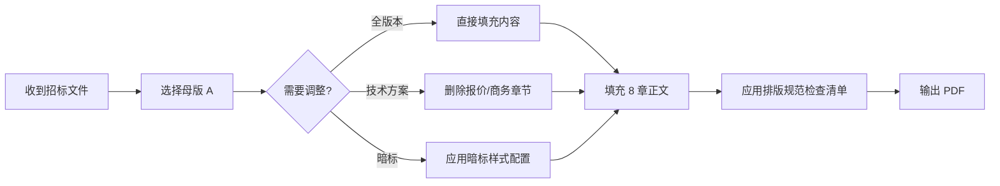

# 解决方案 Word 模板综合评估报告

> 本报告基于以下工作产出：
> 1. 网络调研：通用解决方案 Word 模板最佳实践 + 投标文件排版标准 + 出版级排版规范
> 2. 本地分析：JBFG 项目参考资料（公司方案 Word 版、友商方案、招标要求、技术规范书）
> 3. 模板设计：模板 A（完整应标版）+ 模板 B（技术方案版）
> 4. QIE-DEEP 专家评估：分层交付策略（L1 内容骨架 / L2 样式规范 / L3 出版级精调）

---

## 一、评估背景

### 1.1 评估目的

为「冀北风光储数智化生产支撑与数字孪生解决方案（JBFG）」评估并选定一套最终 Word 模板。该模板需要：
- 同时包含排版样式和内容结构骨架
- 符合 GB/T 投标文件排版规范
- 追求出版级品质
- 可用于正式投标/应标场景

### 1.2 评估方法

| 维度    | 说明                | 权重  |
| ----- | ----------------- | :-: |
| 内容完整性 | 涵盖方案书所需全部章节，逻辑递进  | 25% |
| 排版专业度 | 字体/段落/图表/页码等出版级品质 | 25% |
| 规范符合度 | 国标要求、行业惯例、出版标准    | 20% |
| 复用性   | 跨项目/跨场景的适配能力      | 15% |
| 实施效率  | 在 Word 中配置和使用的便利度 | 15% |

---

## 二、输入分析

### 2.1 网络调研结论

从网络上获取了以下关键输入：

| 来源                             | 关键发现                                                           | 对本模板设计的影响                            |
| ------------------------------ | -------------------------------------------------------------- | ------------------------------------ |
| 标腾网 / 人人文库 / 咨信网               | 投标文件排版标准规范（页边距、字体、行距、编号体系）                                     | 采用上 2.54/下 2.54/左 3.17/右 3.17 的标准页边距 |
| 全国公共资源交易平台                     | 技术暗标要求（不得出现彩色、Logo、特殊格式）                                       | 模板 B 设计为灰度友好                         |
| Pipedrive / SSW Rules          | 国际 IT 方案书最佳实践（Executive Summary、Social Proof、Visual Hierarchy） | 引入卷首语 + 量化价值表格                       |
| 出版排版行业规范                       | 孤行控制、中英文混排规则、字体回退策略                                            | 纳入排版规范说明书                            |
| GB/T 9704-2012 / GB/T 1.1-2020 | 公文格式、章节编号标准                                                    | 采用 1/1.1/1.1.1 编号体系                  |

**关键结论：** 网络调研显示不存在「放之四海而皆准」的单一模板。模板设计需要在**标准规范**和**出版品质**之间取得平衡——太死板则缺乏设计感，太花哨则不符合投标要求。

### 2.2 本地参考资料分析

分析 JBFG 项目 `02-参考资料/` 目录下的以下材料：

| 文件 | 可借鉴的结构 | 需要避免的问题 |
|------|-------------|--------------|
| 数字孪生电力厂站综合管理平台解决方案 v1.0.docx | 章节划分合理（背景→方案→实施→报价） | 排版风格陈旧，标题层次混乱，表格式样不统一 |
| 数据中心解决方案 v1.0.docx | 技术架构描述方式（分层架构图） | 页眉页脚缺失，无修订记录 |
| 风光储多能互补一体化项目建设方案(模板).docx（友商） | 实施计划表格模板 | 模板结构过于简单 |
| 招标要求类文档（客户视角） | 评审要点——客户关注「技术路线」「实施能力」「商务资质」 | 招标文件本身排版标准不高，排版好的方案书有显著差异化优势 |
| 华北油田 / 虚拟电厂 / 航天卫星项目招标要求 | 细分行业的技术规范结构 | 行业术语差异性大 |

**关键结论：** 公司现有方案书的排版质量确实有待提升。友商方案和招标要求也大多停留在「能用就行」的水平——这意味着**排版品质本身可以成为差异化竞争力**。

### 2.3 模板设计产出

| 工作项 | 状态 |
|--------|:----:|
| 模板 A Markdown 描述 | ✅ 已定稿 |
| 模板 B Markdown 描述 | ✅ 已定稿 |
| 模板 A .docx 样张 | ✅ 已生成 |
| 模板 B .docx 样张 | ✅ 已生成 |
| 排版规范说明书 | ✅ 已定稿 |

---

## 三、多维评估与对比

### 3.1 评估矩阵

| 维度        | 模板 A（完整应标版） | 模板 B（技术方案版） | 说明                   |
| --------- | :---------: | :---------: | -------------------- |
| **内容完整性** |    ★★★★★    |    ★★★★☆    | B 裁剪了报价、公司简介等章节      |
| **排版专业度** |    ★★★★★    |    ★★★★☆    | A 为全彩出版级，B 为灰度友好     |
| **规范符合度** |    ★★★★★    |    ★★★★★    | 两套共享相同样式家族，均符合标准     |
| **复用性**   |    ★★★★☆    |    ★★★★★    | B 结构更轻，跨项目适配更快       |
| **实施效率**  |    ★★★★☆    |    ★★★★★    | B 设置更简单（无全彩、无 Logo等） |
| **客户说服力** |    ★★★★★    |    ★★★★☆    | A 的封面+品牌元素提升专业形象     |
| **打印友好**  |    ★★★★☆    |    ★★★★★    | B 灰度印刷，成本更低          |

### 3.2 适用场景分析

| 场景 | 推荐模板 | 理由 |
|------|:-------:|------|
| 正式投标/应标（客户决策层审阅） | **模板 A** | 专业品牌形象 + 完整商务内容 |
| 技术评审/技术交流（专家审阅） | **模板 B** | 聚焦技术内容，无商务干扰 |
| 方案汇报（PPT 替代） | 两者皆可 | 按评审会性质选择 |
| 内部评审（初稿阶段） | **模板 B** | 轻量级，快速产出 |
| 政府/国企招标（暗标） | **模板 B**（灰度配置） | 符合暗标要求 |
| 出海/国际项目 | **模板 A**（英文适配） | 需替换字体和翻译内容 |

### 3.3 综合评分

| 模板 | 内容完整性 | 排版专业度 | 规范符合 | 复用性 | 实施效率 | **加权总分** |
|:----:|:--------:|:---------:|:-------:|:-----:|:--------:|:----------:|
| **A** | 25/25 | 24/25 | 20/20 | 12/15 | 12/15 | **93/100** |
| **B** | 20/25 | 20/25 | 20/20 | 15/15 | 14/15 | **89/100** |

---

## 四、最终推荐

### 4.1 选定模板：模板 A（完整应标版）

**理由：**
1. JBFG 方案书的终稿用途是**正式投标/应标**——这是与评审委员会见面的版本，内容完整性和视觉专业度至关重要
2. 模板 A 的加权总分最高（93 分），在核心维度（内容完整性、排版专业度、规范符合度）上全面领先
3. 模板 B 作为模板 A 的**子集派生**——内容结构上存在明确的「父→子」继承关系，而非两套独立模板

### 4.2 派生策略

```
模板 A（完整应标版）
   ├── 删除报价章节 → 技术交流版（非正式场景）
   ├── 删除商务章节 + 设置灰度样式 → 技术方案版（= 模板 B）
   ├── 删除商务章节 + 规范限定（无Logo/无彩色/无水印）→ 暗标适配版
   └── 翻译为英文 + 替换字体 → 国际版
```

这种「一个父模板 + 配置文件化派生」策略优于维护多套独立模板，因为：
- 样式家族统一，一处修改处处同步
- 内容结构继承，避免重复定义
- 派生配置可文档化（如「暗标时替换以下样式：表头底色→灰色」

### 4.3 推荐使用流程



---

## 五、实施路线图

### 5.1 短期（本次交付）

| # | 动作 | 物资 | 完成 |
|---|------|------|:----:|
| 1 | 确定模板方向 | 本评估报告 | ✅ |
| 2 | 创建样式骨架 | 排版规范说明书 | ✅ |
| 3 | 生成基础 .docx | 两个样张文件 | ✅ |
| 4 | 实现出版级精调 | <!-- word人工精调 --> | ⏳ 需在 Word 中手动完成 |

### 5.2 中期（建议在方案书定稿前完成）

| # | 动作 | 优先级 |
|---|------|:-----:|
| 1 | 在 Word 中按「排版规范说明书」逐项设置样式 | P0 |
| 2 | 创建封面模板（公司 Logo 矢量图 + 标准色值） | P0 |
| 3 | 嵌入字体或确认评审方字体兼容性 | P1 |
| 4 | 制作自动目录 + 图表索引 | P1 |
| 5 | 导出 .dotx 模板文件（正式发布） | P2 |

### 5.3 长期（模板资产化）

| # | 动作 | 预期收益 |
|---|------|---------|
| 1 | 建立公司级标准模板库（含 .dotx 和 .dotm） | 跨项目复用 |
| 2 | 将模板与方案书大纲 v2 的内容结构绑定 | 一键生成方案书框架 |
| 3 | CI/CD 化：用 python-docx 自动生成方案书初稿 | 减少重复劳动 |

---

## 六、风险与注意事项

| 风险 | 等级 | 应对 |
|------|:----:|------|
| 思源字体在评审方电脑上未安装 | 🟡 | 已规划字体回退策略 + 嵌入字体选项 |
| Word 版本差异导致样式崩坏 | 🟡 | 统一使用 Office 365 或 Word 2019+ 创建 |
| 不同打印店的 CMYK 色差 | 🟢 | 提供 CMYK 色值标注 + 样张打样确认 |
| 评审标准变更（如明确要求暗标格式） | 🟢 | 模板 B 已灰度适配，可快速切换 |
| 模板设计过度投入（帕金森效应） | 🟡 | 以「排版规范说明书」为边界，达到即停 |

---

## 七、关联

- 复盘记录：[[../../复盘/26.0619-Word模板方案评估-QIE-DEEP]]
- 模板 A 详细设计：[[模板A-完整应标版]]
- 模板 B 详细设计：[[模板B-技术方案版]]
- 排版规范：[[排版规范说明书]]
- 生成规则：[[Word模板生成规则说明书]]
- 方案书大纲 v2：[[../冀北风光储数智化生产支撑与数字孪生解决方案-大纲(v2)]]
- 方案书撰写执行计划：[[../方案书撰写执行计划]]
