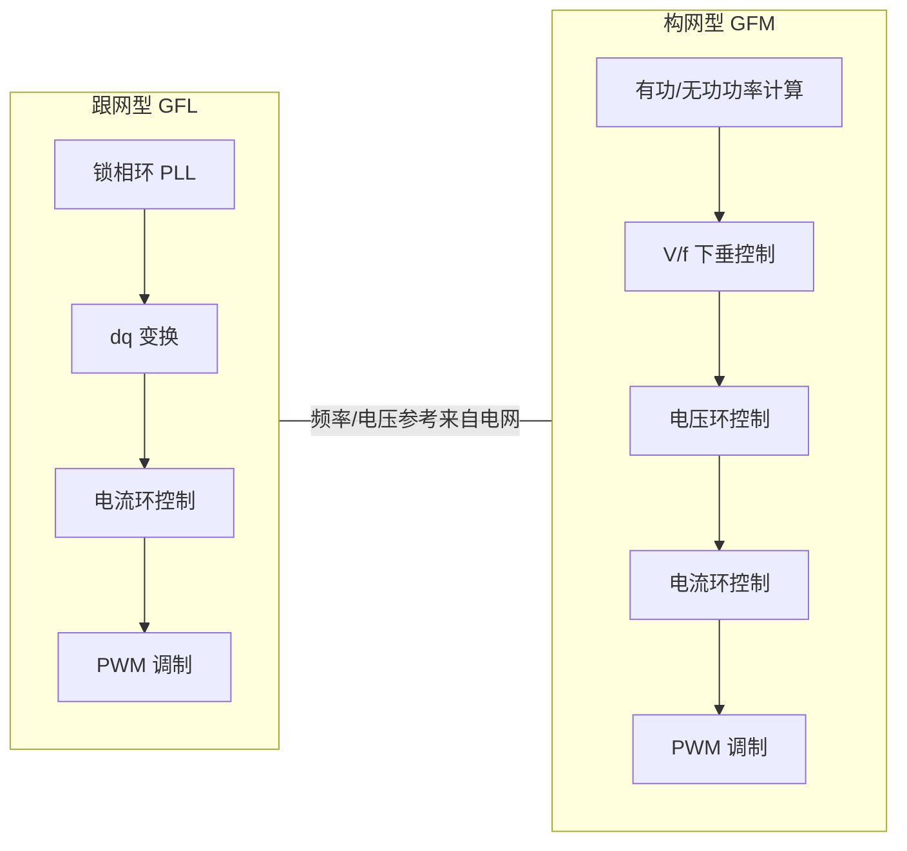

# 构网型 (GFM) vs 跟网型 (GFL)

## 一句话分界

> **跟网型**锁相跟随电网，**构网型**自主建立电网。
> GFL 是"电流源"，GFM 是"电压源"。

这不是外环优化策略的差异，而是**逆变器最内层控制环（电流/电压环）的范式切换**。

## 控制原理对比

| 层级       | GFL                | GFM                |
| -------- | ------------------ | ------------------ |
| **同步机制** | PLL 锁定电网电压相位       | 自主生成电压频率参考（无需 PLL） |
| **控制目标** | 输出指定有功/无功功率        | 建立并维持电压幅值和频率       |
| **电网角色** | 被动跟随者              | 主动参与者（可支撑孤岛）       |
| **短路贡献** | 约 1.1pu（PLL 锁相时间内） | 1.2~1.5pu（暂态过流能力）  |
| **惯量响应** | 无天然惯量              | 虚拟惯量，响应 < 50ms     |
| **稳定性**  | SCR < 1.5 时可能失稳    | SCR 可低至 1.0        |

## 需要被纠正的常见误解

| 误解 | 纠正 |
|------|------|
| "构网型就是更智能的跟网型" | **控制内环不同**。GFL 是 PLL 跟随，GFM 是 V/f 自主建立，两者是"换发动机"而非"换软件" |
| "构网型可以不装 PLL" | 大多数 GFM 仍含 PLL 用于监测和后备同步，只不在控制主回路中 |
| "构网型微电网就等于构网型场站" | 微电网 GFM 控制单机/小系统；场站 GFM 需考虑多机并联、谐振、均流等大系统问题 |
| "构网型与跟网型可以混用" | 可以，但需要精确的功率分配策略和稳定性分析 |
| "构网型改造只是软件升级" | **不是**。逆变器硬件（过流能力、DC-link 电容、滤波器）可能需要改造 |

## 在 JBFG 项目中的意义

| 问题                      | 答案                                                      |
| ----------------------- | ------------------------------------------------------- |
| 本项目的可视化层是否需要区分 GFM/GFL？ | **不需要**。可视化层只展示指标数据，不关心逆变器控制内环                          |
| 构网型指标对展示意味着什么？          | GFM 场站的展示指标更多（惯量响应、下垂特性等），GFL 场站只有 AGC/AVC 等            |
| 方案书如何处理这个差异？            | 建议将指标清单做**两套标注**：标注哪些指标仅 GFM 可见、哪些通用。客户场站配置未知时不承诺具体指标数量 |

## 关键判断

> 本项目涉及的是**可视化展示层**，无论底层逆变器是 GFM 还是 GFL，展示框架均可复用。
> 唯一差异在于**可展示的指标范围**——GFM 场站多出惯量响应、下垂控制能力、黑启动准备状态等 3~5 项，方案书应注明"可视化平台支持构网型指标扩展"。

## 参考来源

- IEEE 1547-2018 — 分布式能源并网互操作标准（含 GFM 要求）
- CIGRE TB 794 — Grid-Forming Converters: A Review (2020)
- 中国电科院《构网型新能源并网技术白皮书》(2023)
- [推断] 基于行业技术文献的归纳

## 关联

- 上级：[[99-知识体系]]
- 主概念：[[构网型透明场站|构网型透明场站]] — 在概念层面整合 GFM + 透明展示
- 辨析：[[数智化 vs 数字化]] — 辨析笔记的同级参考
